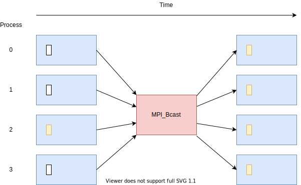

Simple collective communication
===============================

.. questions::

   - How can all ranks of my program collaborate with messages?
   - How does collective messaging differ from point-to-point?

.. objectives::

   - Know the different kinds of collective message operations
   - Understand the terminology used in MPI about collective messages
   - Understand how to combine data from ranks of a communicator in an operation

Introduction
------------

Parallel programs often need to collaborate when passing messages:

* To ensure that all ranks have reached a certain point (barrier)
* To share data with all ranks (broadcast)
* To compute based on data from all ranks (reduce)
* To rearrange data across ranks for subsequent computation (scatter, gather)

These can all be done with point-to-point messages. However that
requires more code, runs slower, and scales worse that using the
optimized collective calls.

There are several other operations that generalize these building
blocks:

* gathering data from all ranks and delivering the same data to all
  ranks
* all-to-all scatter and gather of different data to all ranks

Finally, MPI supports reduction operations, where a logical or
arithmetic operation can be used to efficiently compute while
communicating data.

Barrier
-------

An ``MPI_Barrier`` call ensures that all ranks arrive at the call before
any of them proceeds past it.

   All ranks in the communicator reach the barrier before any continue past it

``MPI_Barrier`` is `blocking` (ie. does not return until the operation
is complete) and introduces `collective synchronization` into the
program. This can be useful to allow rank to wait for an external
event (e.g. files being written by another process) before entering
the barrier, rather than have all ranks checking.

When debugging problems in other MPI communication, adding calls to
``MPI_Barrier`` can be useful. However, if a barrier is necessary for
your program to function correctly, that may suggest your
program has a bug!

.. signature:: |term-MPI_Barrier|

   .. code-block:: c

      int MPI_Barrier(MPI_Comm comm)

.. parameters::

   It takes one argument, the communicator over which the barrier
   operates.  All ranks within that communicator must call it or the
   program will hang waiting for them to do so.

Broadcast
---------

An ``MPI_Bcast`` call sends data from one rank to all other ranks.

   After the call, all ranks in the communicator agree on the two values
   sent.

``MPI_Bcast`` is `blocking` and introduces `collective
synchronization` into the program.

This can be useful to allow one rank to share values to all
other ranks in the communicator. For example, one rank might read
a file, and then broadcast the content to all other ranks. This is
usually more efficient than having each rank read the same file.

.. signature:: |term-MPI_Bcast|

   Sends data from one rank to all other ranks

   .. code-block:: c

      int MPI_Bcast(void *buffer, int count, MPI_Datatype datatype,
                    int root, MPI_Comm comm)

.. parameters::

   All ranks must supply the same value for ``root``, which specifies
   the rank of that communicator that provides the values that are
   broadcast to all other ranks.

   ``buffer``, ``count``, ``datatype``, and ``comm`` are similar to those
   used for point-to-point communication; all ranks in the communicator
   must participate with valid buffers and consistent counts and types.

Reduce
------

An ``MPI_Reduce`` call combines data from all ranks using an operation
and returns values to a single rank.

.. figure:: img/MPI_Reduce.svg
   :align: center

   After the call, the root rank has a value computed by combining a
   value from each other rank in the communicator with an operation.

``MPI_Reduce`` is `blocking` and introduces `collective
synchronization` into the program.

There are several kinds of pre-defined operation, including arithmetic
and logical operations. A full list of operations is available in the
linked documentation.

This is useful to allow one rank to compute based on values from all
other ranks in the communicator. For example, the maximum value found
over all ranks (and even the rank upon which it was found) can be
returned to the root rank. Often one simply wants a sum, and for that
``MPI_SUM`` is provided. 

.. signature:: |term-MPI_Reduce|

   Combines data from all ranks using an operation and returns values
   to a single rank.

   .. code-block:: c

      int MPI_Reduce(const void *sendbuf, void *recvbuf, int count,
                     MPI_Datatype datatype, MPI_Op op,
                     int root, MPI_Comm comm)

.. parameters::

   All ranks must supply the same value for ``root``, which specifies
   the rank of the process within that communicator that receives the
   values send from each process.

   ``sendbuf``, ``count`` and ``datatype`` describe the buffer on
   **each** process from which the data is sent. Only a buffer large
   enough to contain the data sent by that process is needed.

   ``recvbuf``, ``count`` and ``datatype`` describe the buffer on the
   **root** process in which the combined data is received. Other
   ranks do not need to allocate a receive buffer, and may pass any
   values to the call.

   All ranks in the communicator must participate with valid send
   buffers and consistent counts and types.

Code-along exercise: broadcast and reduce
-----------------------------------------

.. challenge:: 1.1 Use a broadcast and observe the results with reduce

   1. Download the :download:`source code
      <code/collective-communication-broadcast.c>`. Open
      ``collective-communication-broadcast.c`` and read through it. Try
      to compile with::

        mpicc -g -Wall -std=c11 collective-communication-broadcast.c -o collective-communication-broadcast

   2. When you have the code compiling, try to run with::

        mpiexec -np 2 ./collective-communication-broadcast

   3. Use clues from the compiler and the comments in the code to
      change the code so it compiles and runs. Try to get all ranks to
      report success :-)

.. solution::

   * One correct pair of calls is::

         MPI_Bcast(values_to_broadcast, 2, MPI_INT, rank_of_root, comm);
         /* ... */
         MPI_Reduce(values_to_broadcast, reduced_values, 2, MPI_INT,
                    MPI_SUM, rank_of_root, comm);

   * There are other calls that work correctly. Is yours better or worse
     than this one? Why?
   * Download a :download:`working solution <code/collective-communication-broadcast-solution.c>`

Tips when using collective communication
----------------------------------------

Unlike point-to-point messages, collective communication does not use
tags. This is deliberate, because collective communication requires
all ranks in the communicator to contribute to the work before any
rank will return from the call. There's no facility for more than one
collective communication to run at a time on a communicator, so
there's no need for a tag to clarify which communication is taking
place. That's implied by the **order** of the collective communication
calls.

However, it's fine to use point-to-point messages on the same
communicator in any order; they work independently.

.. challenge:: 1.2 Quiz: if one rank calls a reduce,
   and another rank calls a broadcast, is it a problem?

   1. Yes, always.

   2. No, never.

   3. Yes when they are using the same communicator

.. solution::

   3. Collectives *on the same communicator* must be called in the
      same order by all ranks of that communicator. Collectives on
      different communicators from disjoint groups of ranks don't
      create problems for eachother.

See also
--------

* Check out the `MPI standard <https://www.mpi-forum.org/docs/mpi-3.1/mpi31-report/node95.htm#Node95>`_
* https://www.codingame.com/playgrounds/349/introduction-to-mpi/introduction-to-collective-communications

.. keypoints::

   - Collective communication requires participation of all ranks in that communicator
   - Collective communication happens *in order* and so no tags are needed.
