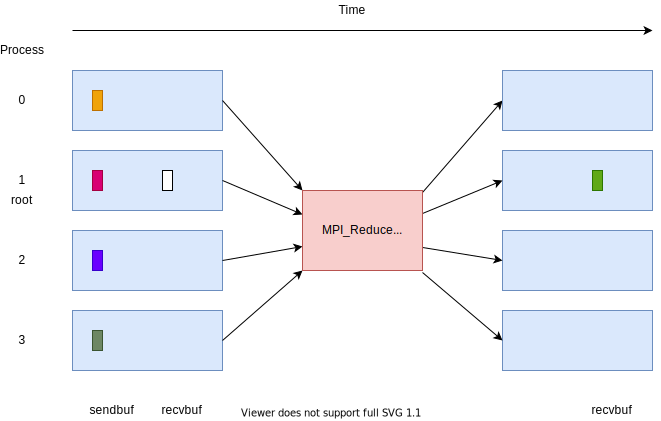

Collective communication 1
==========================

.. questions::

   - How can all ranks of my program collaborate with messages?
   - How does collective messaging differ from point-to-point?

.. objectives::

   - Know the different kinds of collective message operations
   - Understand the terminology used in MPI about collective messages

Introduction
------------

Parallel programs often need to collaborate when passing messages:

* To ensure that all ranks have reached a certain point (barrier)
* To share data with all ranks (broadcast)
* To compute based on data from all ranks (reduce)
* To rearrange data across ranks for subsequent computation (scatter, gather)

These can all be done with point-to-point messages. However that
requires more code, runs slower, and scales worse that using the
optimized collective calls.

There are several other operations that generalize these building
blocks:

* gathering data from all ranks and delivering the same data to all
  ranks
* all-to-all scatter and gather of different data to all ranks

Finally, MPI supports reduction operations, where a logical or
arithmetic operation can be used to efficiently compute while
communicating data.

Barrier
-------

An ``MPI_Barrier`` call ensures that all ranks arrive at the call before
any of them proceeds past it.

.. figure:: img/MPI_Barrier.svg
   :align: center

   All ranks in the communicator reach the barrier before any continue past it

``MPI_Barrier`` is `blocking` (ie. does not return until the operation
is complete) and introduces `collective synchronization` into the
program. This can be useful to allow rank to wait for an external
event (e.g. files being written by another process) before entering
the barrier, rather than have all ranks checking.

When debugging problems in other MPI communication, adding calls to
``MPI_Barrier`` can be useful. However, if a barrier is necessary for
your program to function correctly, that may suggest your
program has a bug!

Call signature::

  int MPI_Barrier(MPI_Comm comm)

Link to `MPI_Barrier man page <https://www.open-mpi.org/doc/v4.0/man3/MPI_Barrier.3.php>`_

Link to `Specification of MPI_Barrier <https://www.mpi-forum.org/docs/mpi-3.1/mpi31-report/node100.htm#Node100>`_

.. note::

   It takes one argument, the communicator over which the barrier
   operates.  All ranks within that communicator must call it or the
   program will hang waiting for them to do so.

Broadcast
---------

An ``MPI_Bcast`` call sends data from one rank to all other ranks.

.. figure:: img/MPI_Bcast.svg
   :align: center

   After the call, all ranks in the communicator agree on the two values
   sent.

``MPI_Bcast`` is `blocking` and introduces `collective
synchronization` into the program.

This can be useful to allow one rank to share values to all
other ranks in the communicator. For example, one rank might read
a file, and then broadcast the content to all other ranks. This is
usually more efficient than having each rank read the same file.

Call signature::

  int MPI_Bcast(void *buffer, int count, MPI_Datatype datatype,
                int root, MPI_Comm comm)

Link to `MPI_Bcast man page <https://www.open-mpi.org/doc/v4.0/man3/MPI_Bcast.3.php>`_

Link to `Specification of MPI_Bcast <https://www.mpi-forum.org/docs/mpi-3.1/mpi31-report/node101.htm#Node101>`_

.. note::

   All ranks must supply the same value for ``root``, which specifies
   the rank of that communicator that provides the values that are
   broadcast to all other ranks.

   ``buffer``, ``count``, ``datatype``, and ``comm`` are similar to those
   used for point-to-point communication; all ranks in the communicator
   must participate with valid buffers and consistent counts and types.

Reduce
------

An ``MPI_Reduce`` call combines data from all ranks using an operation
and returns values to a single rank.

   After the call, the root rank has a value computed by combining a
   value from each other rank in the communicator with an operation.

``MPI_Reduce`` is `blocking` and introduces `collective
synchronization` into the program.

There are several kinds of pre-defined operation, including arithmetic
and logical operations. A full list of operations is available in the
linked documentation.

This is useful to allow one rank to compute based on values from all
other ranks in the communicator. For example, the maximum value found
over all ranks (and even the rank upon which it was found) can be
returned to the root rank. Often one simply wants a sum, and for that
``MPI_SUM`` is provided. 

Call signature::

  int MPI_Reduce(const void *sendbuf, void *recvbuf, int count,
                 MPI_Datatype datatype, MPI_Op op,
                 int root, MPI_Comm comm)

Link to `MPI_Reduce man page <https://www.open-mpi.org/doc/v4.0/man3/MPI_Reduce.3.php>`_

Link to `Specification of MPI_Reduce <https://www.mpi-forum.org/docs/mpi-3.1/mpi31-report/node111.htm#Node111>`_

.. note::

   All ranks must supply the same value for ``root``, which specifies
   the rank of the process within that communicator that receives the
   values send from each process.

   ``sendbuf``, ``count`` and ``datatype`` describe the buffer on
   **each** process from which the data is sent. Only a buffer large
   enough to contain the data sent by that process is needed.

   ``recvbuf``, ``count`` and ``datatype`` describe the buffer on the
   **root** process in which the combined data is received. Other
   ranks do not need to allocate a receive buffer, and may pass any
   values to the call.

   All ranks in the communicator must participate with valid send
   buffers and consistent counts and types.

Code-along exercise: broadcast and reduce
-----------------------------------------

.. challenge:: 1.1 Use a broadcast and observe the results with reduce

   1. Download the :download:`source code
      <code/collective-communication-broadcast.c>`. Open
      ``collective-communication-broadcast.c`` and read through it. Try
      to compile with::

        mpicc -g -Wall -std=c11 collective-communication-broadcast.c -o collective-communication-broadcast

   2. When you have the code compiling, try to run with::

        mpiexec -np 2 ./collective-communication-broadcast

   3. Use clues from the compiler and the comments in the code to
      change the code so it compiles and runs. Try to get all ranks to
      report success :-)

.. solution::

   * One correct call is::

         MPI_Bcast(values_to_broadcast, 2, MPI_INT, rank_of_root, comm);

   * There are other calls that work correctly. Is yours better or worse
     than this one? Why?
   * Download a :download:`working solution <code/collective-communication-broadcast-solution.c>`

Scatter
---------

An ``MPI_Scatter`` call sends data from one rank to all other ranks.

.. figure:: img/MPI_Scatter.svg
   :align: center

   After the call, all ranks in the communicator have the one value
   sent from the root rank, ordered by rank number.

``MPI_Scatter`` is `blocking` and introduces `collective
synchronization` into the program.

This can be useful to allow one rank to share values to all other
ranks in the communicator. For example, one rank might compute some
values, and then scatter the content to all other ranks. They can then
use this as input for future work.

Call signature::

  int MPI_Scatter(const void *sendbuf, int sendcount, MPI_Datatype sendtype,
                  void *recvbuf, int recvcount, MPI_Datatype recvtype,
                  int root, MPI_Comm comm)

Link to `MPI_Scatter man page <https://www.open-mpi.org/doc/v4.0/man3/MPI_Scatter.3.php>`_

Link to `Specification of MPI_Scatter <https://www.mpi-forum.org/docs/mpi-3.1/mpi31-report/node105.htm#Node105>`_

.. note::

   All ranks must supply the same value for ``root``, which specifies
   the rank of that communicator that provides the values that are
   sent to all other ranks.

   ``sendbuf``, ``sendcount`` and ``sendtype`` describe the buffer on
   the **root** process from which the data comes. Other ranks do not need
   to allocate a send buffer, and may pass any values to the call.

   ``recvbuf``, ``recvcount`` and ``recvtype`` describe the buffer on
   **each** process to which the data is sent. Only a buffer large
   enough to receive the data for that process is needed.

   All ranks in the communicator must participate with valid receive
   buffers and consistent counts and types.

Gather
---------

An ``MPI_Gather`` call sends data from all ranks to a single rank.
It is the inverse operation of ``MPI_Scatter``.

.. figure:: img/MPI_Gather.svg
   :align: center

   After the call, the root rank has one value from each other rank in
   the communicator, ordered by rank number.

``MPI_Gather`` is `blocking` and introduces `collective
synchronization` into the program.

This can be useful to allow one rank to collect values from all other
ranks in the communicator. For example, all ranks might compute some
values, and then the root rank gathers the content. It can then use
this as input for future work. One use case is to combine data so that
one rank can compute a combined property, or write all the data to a
file.

Call signature::

  int MPI_Gather(const void *sendbuf, int sendcount, MPI_Datatype sendtype,
                 void *recvbuf, int recvcount, MPI_Datatype recvtype,
                 int root, MPI_Comm comm)

Link to `MPI_Gather man page <https://www.open-mpi.org/doc/v4.0/man3/MPI_Gather.3.php>`_

Link to `Specification of MPI_Gather <https://www.mpi-forum.org/docs/mpi-3.1/mpi31-report/node103.htm#Node103>`_

.. note::

   All ranks must supply the same value for ``root``, which specifies
   the rank of the process within that communicator that receives the
   values send from each process.

   ``sendbuf``, ``sendcount`` and ``sendtype`` describe the buffer on
   **each** process from which the data is sent. Only a buffer large
   enough to contain the data sent by that process is needed.

   ``recvbuf``, ``recvcount`` and ``recvtype`` describe the buffer on
   the **root** process in which the data is received. Other ranks do
   not need to allocate a receive buffer, and may pass any values to
   the call.

   All ranks in the communicator must participate with valid send
   buffers and consistent counts and types.

 
Exercise: scatter and gather
----------------------------

TODO

.. challenge:: 2.1 Scatter

   2. Notice the exercise set has both an ID and
      number ``SampleLesson-2`` and description of what it contains.

.. solution::

   * Solution here.

.. challenge:: 2.2 Gather

   3. Similarly, each exercise has a quick description title ``Create
      a lesson`` in bold.  These titles are useful so that helpers
      (and learners...) can quickly understand what the point is.

.. solution::

   * Solution to that one.

.. challenge:: 2.3 Scatter and gather

   4. Similarly, each exercise has a quick description title ``Create
      a lesson`` in bold.  These titles are useful so that helpers
      (and learners...) can quickly understand what the point is.

.. solution::

   * Solution to that one.

All-gather
----------

An ``MPI_Allgather`` call gather the same data from all ranks and
provides it to all ranks. It is logically identical to ``MPI_Gather``
to a root followed by an ``MPI_Bcast`` from that root, but is
implemented more efficiently.

.. figure:: img/MPI_Allgather.svg
   :align: center

   After the call, all ranks have one value from each other rank in
   the communicator, ordered by rank number.

``MPI_Allgather`` is `blocking` and introduces `collective
synchronization` into the program. Note that there is no root
for this operation.

This can be useful to allow all ranks to collect values from all other
ranks in the communicator. For example, all ranks might compute some
values, and then all ranks gather that content to use it in a
subsequent stage.

Call signature::

  int MPI_Allgather(const void *sendbuf, int  sendcount, MPI_Datatype sendtype,
                    void *recvbuf, int recvcount, MPI_Datatype recvtype,
                    MPI_Comm comm)

Link to `MPI_Allgather man page <https://www.open-mpi.org/doc/v4.0/man3/MPI_Allgather.3.php>`_

Link to `Specification of MPI_Allgather <https://www.mpi-forum.org/docs/mpi-3.1/mpi31-report/node107.htm#Node107>`_

.. note::

   All ranks receive the values send from each process.

   ``sendbuf``, ``sendcount`` and ``sendtype`` describe the buffer on
   **each** process from which the data is sent. Only a buffer large
   enough to contain the data sent by that process is needed.

   ``recvbuf``, ``recvcount`` and ``recvtype`` describe the buffer on
   **each** process to which the data is sent. A buffer large
   enough to receive all the data for that process is needed.

   All ranks in the communicator must participate with valid receive
   buffers and consistent counts and types.

All-to-all
----------

An ``MPI_Alltoall`` call gathers data from all ranks and provides
distinct data to all ranks. It is logically identical to making one
call to ``MPI_Gather`` for each possible root rank, but is implemented
more efficiently.

.. figure:: img/MPI_Alltoall.svg
   :align: center

   After the call, all ranks have one value from each other rank in
   the communicator, ordered by rank number.

``MPI_Alltoall`` is `blocking` and introduces `collective
synchronization` into the program. Note that there is no root
for this operation.

This can be useful to allow all ranks to collect values from all other
ranks in the communicator. For example, a 3D Fast Fourier Transform
often uses an all-to-all operation to redistribute the working data
set for each process to a new dimension.

Call signature::

  int MPI_Alltoall(const void *sendbuf, int sendcount, MPI_Datatype sendtype,
                   void *recvbuf, int recvcount, MPI_Datatype recvtype,
                   MPI_Comm comm)

Link to `MPI_Alltoall man page <https://www.open-mpi.org/doc/v4.0/man3/MPI_Alltoall.3.php>`_

Link to `Specification of MPI_Alltoall <https://www.mpi-forum.org/docs/mpi-3.1/mpi31-report/node109.htm#Node109>`_

.. note::

   All ranks receive a subset of the values sent from each process.

   ``sendbuf``, ``sendcount`` and ``sendtype`` describe the buffer on
   **each** process from which the data is sent. Only a buffer large
   enough to contain the data sent by that process is needed.

   ``recvbuf``, ``recvcount`` and ``recvtype`` describe the buffer on
   **each** process to which the data is sent. A buffer large
   enough to receive all the data for that process is needed.

   All ranks in the communicator must participate with valid receive
   buffers and consistent counts and types.

Another section
---------------

.. instructor-note::

   This is an instructor note.  It may be hidden or put to the sidebar
   in a later style.  You should use it for things that the instructor
   should see while teaching, but should be de-emphasized for the
   learners.

See also
--------

* Upstream information
* Another course

.. keypoints::

   - What the learner should take away
   - point 2
   - ...
