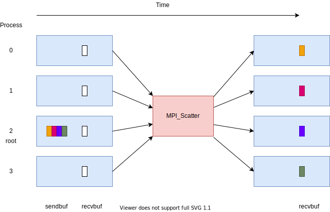

Scatter and gather
==================

.. questions::

   - How can I split data across the ranks of my program?
   - How can I join data from the ranks of my program?

.. objectives::

   - Know the difference between scatter and gather

Scatter
-------

An ``MPI_Scatter`` call sends data from one rank to all other ranks.

   After the call, all ranks in the communicator have the one value
   sent from the root rank, ordered by rank number.

``MPI_Scatter`` is `blocking` and introduces `collective
synchronization` into the program.

This can be useful to allow one rank to share values to all other
ranks in the communicator. For example, one rank might compute some
values, and then scatter the content to all other ranks. They can then
use this as input for future work.

.. signature:: |term-MPI_Scatter|

   .. code-block:: c

      int MPI_Scatter(const void *sendbuf, int sendcount, MPI_Datatype sendtype,
                      void *recvbuf, int recvcount, MPI_Datatype recvtype,
                      int root, MPI_Comm comm)

.. parameters::

   All ranks must supply the same value for ``root``, which specifies
   the rank of that communicator that provides the values that are
   sent to all other ranks.

   ``sendbuf``, ``sendcount`` and ``sendtype`` describe the buffer on
   the **root** process from which the data comes. ``sendcount``
   describes the extent of the buffer sent to each other rank, not the
   extent of the whole buffer! Other ranks do not need to allocate a
   send buffer, and may pass any values to the call.

   ``recvbuf``, ``recvcount`` and ``recvtype`` describe the buffer on
   **each** process to which the data is sent. Only a buffer large
   enough to receive the data for that process is needed.

   All ranks in the communicator must participate with valid receive
   buffers and consistent counts and types.

Gather
------

An ``MPI_Gather`` call sends data from all ranks to a single rank.
It is the inverse operation of ``MPI_Scatter``.

.. figure:: img/MPI_Gather.svg
   :align: center

   After the call, the root rank has one value from each other rank in
   the communicator, ordered by rank number.

``MPI_Gather`` is `blocking` and introduces `collective
synchronization` into the program.

This can be useful to allow one rank to collect values from all other
ranks in the communicator. For example, all ranks might compute some
values, and then the root rank gathers the content. It can then use
this as input for future work. One use case is to combine data so that
one rank can compute a combined property, or write all the data to a
file.

.. signature:: |term-MPI_Gather|

   .. code-block:: c

      int MPI_Gather(const void *sendbuf, int sendcount, MPI_Datatype sendtype,
                     void *recvbuf, int recvcount, MPI_Datatype recvtype,
                     int root, MPI_Comm comm)

.. parameters::

   All ranks must supply the same value for ``root``, which specifies
   the rank of the process within that communicator that receives the
   values send from each process.

   ``sendbuf``, ``sendcount`` and ``sendtype`` describe the buffer on
   **each** process from which the data is sent. Only a buffer large
   enough to contain the data sent by that process is needed.

   ``recvbuf``, ``recvcount`` and ``recvtype`` describe the buffer on
   the **root** process in which the data is received. ``revcount``
   describes the extent of the buffer received from each rank, not the
   extent of the whole buffer! Other ranks do not need to allocate a
   receive buffer, and may pass any values to the call.

   All ranks in the communicator must participate with valid send
   buffers and consistent counts and types.

 
Exercise: scatter and gather (1)
--------------------------------

.. challenge:: Use scatter and gather

   You can find a scaffold for the code ``scatter-and-gather-1.c`` in the
   ``content/code/day-2/00_scatter-and-gather`` folder.  A working solution is
   in the ``solution`` subfolder. It's similar to the broadcast code we saw
   earlier. Try to compile with::

        mpicc -g -Wall -std=c11 scatter-and-gather-1.c -o scatter-and-gather-1

   #. When you have the code compiling, try to run with::

        mpiexec -np 4 ./scatter-and-gather-1

   #. Use clues from the compiler and the comments in the code to
      change the code so it compiles and runs. Try to get all ranks to
      report success :-)

.. solution::

   * One correct pair of calls is::

         MPI_Scatter(values_to_scatter, 1, MPI_FLOAT,
                     &scattered_value, 1, MPI_FLOAT,
                     rank_of_scatter_root, comm);
         /* ... */
         MPI_Gather(&result, 1, MPI_FLOAT,
                    gathered_values, 1, MPI_FLOAT,
                    rank_of_gather_root, comm);

   * What would happen if you mistakenly used 4 for the scatter send count
     or the gather receive count. Why?

   * What would happen if you mistakenly used more (or fewer) MPI proccesses
     to run the code (e.g. ``mpiexec -np 5 ...``)?

Exercise: scatter and gather (2)
--------------------------------

.. challenge:: Use scatter and gather on more data

   You can find a scaffold for the code ``scatter-and-gather-2.c`` in the
   ``content/code/day-2/00_scatter-and-gather`` folder.

   In this exercise you'll use ``MPI_Scatter`` to split a matrix into row
   vectors. The number of rows in the matrix is equal to the number of
   processes, and each vector will be stored on the individual processes.
   After scatter, you can also use ``MPI_Gather`` to assemble the vectors
   into a matrix.

   A working solution is
   in the ``solution`` subfolder. It's similar to the broadcast code we saw
   earlier. Try to compile with::

        mpicc -g -Wall -std=c11 scatter-and-gather-2.c -o scatter-and-gather-2

   #. When you have the code compiling, try to run with different number of
      MPI processes.

   #. Try to get all ranks to report success :-)

.. solution::

   * One correct pair of calls is::

         MPI_Scatter(matrix, size, MPI_FLOAT,
                     vector, 1, MPI_FLOAT,
                     0, comm);
         /* ... */
         MPI_Gather(matrix_2, size, MPI_FLOAT,
                    vector, size, MPI_FLOAT,
                    0, comm);

Exercise: scatter and gather (3)
--------------------------------

.. challenge:: Use scatter and gather to compute inner product of vectors

   You can find a scaffold for the code ``scatter-and-gather-3.c`` in the
   ``content/code/day-2/00_scatter-and-gather`` folder.

   In this exercise you'll use ``MPI_Scatter`` to split two vectors into
   segments and compute their inner product in parallel.
   After scatter, you can use ``MPI_Reduce`` to collect the final result,
   and use ``MPI_Gather`` to collect timing information.

   A working solution is
   in the ``solution`` subfolder. It's similar to the broadcast code we saw
   earlier. Try to compile with::

        mpicc -g -Wall -std=c11 scatter-and-gather-3.c -o scatter-and-gather-3

   #. When you have the code compiling, try to run with different number of
      MPI processes.

   #. Try to rank 0 to report success :-)

See also
--------

* http://www.archer.ac.uk/training/course-material/2020/01/advMPI-imperial/Slides/AMPP-Advanced-Collectives.pdf
* https://www.codingame.com/playgrounds/349/introduction-to-mpi/scattering-and-gathering

.. keypoints::

   - MPI applications can scatter and gather data to suit common application patterns.

