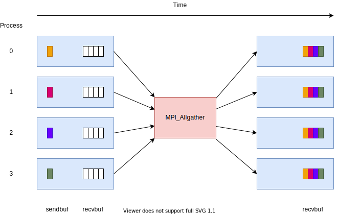

Generalized forms of gather
===========================

.. questions::

   - How can I do more complex rearrangements of data?

.. objectives::

   - Know that gather can be generalized
   - Know the difference between generalized forms of gather

All-gather
----------

An ``MPI_Allgather`` call gather the same data from all ranks and
provides it to all ranks. It is logically identical to ``MPI_Gather``
to a root followed by an ``MPI_Bcast`` from that root, but is
implemented more efficiently.

   After the call, all ranks have one value from each other rank in
   the communicator, ordered by rank number.

``MPI_Allgather`` is `blocking` and introduces `collective
synchronization` into the program. Note that there is no root
for this operation.

This can be useful to allow all ranks to collect values from all other
ranks in the communicator. For example, all ranks might compute some
values, and then all ranks gather that content to use it in a
subsequent stage.

.. signature:: |term-MPI_Allgather|

   Gathers data from all ranks and provides the same data to all ranks.

   .. code-block:: c

      int MPI_Allgather(const void *sendbuf, int sendcount, MPI_Datatype sendtype,
                        void *recvbuf, int recvcount, MPI_Datatype recvtype,
                        MPI_Comm comm)

.. parameters::

   All ranks receive the values send from each process.

   ``sendbuf``, ``sendcount`` and ``sendtype`` describe the buffer on
   **each** process from which the data is sent. Only a buffer large
   enough to contain the data sent by that process is needed.

   ``recvbuf``, ``recvcount`` and ``recvtype`` describe the buffer on
   **each** process to which the data is sent. A buffer large
   enough to receive all the data for that process is needed.

   All ranks in the communicator must participate with valid receive
   buffers and consistent counts and types.

All-to-all
----------

An ``MPI_Alltoall`` call gathers data from all ranks and provides
distinct data to all ranks. It is logically identical to making one
call to ``MPI_Gather`` for each possible root rank, but is implemented
more efficiently.

.. figure:: img/MPI_Alltoall.svg
   :align: center

   After the call, all ranks have one value from each other rank in
   the communicator, ordered by rank number.

``MPI_Alltoall`` is `blocking` and introduces `collective
synchronization` into the program. Note that there is no root
for this operation.

This can be useful to allow all ranks to collect values from all other
ranks in the communicator. For example, a 3D Fast Fourier Transform
often uses an all-to-all operation to redistribute the working data
set for each process to a new dimension.

.. signature:: |term-MPI_Alltoall|

   Gathers data from all ranks and provides distinct data to all ranks.

   .. code-block:: c

      int MPI_Alltoall(const void *sendbuf, int sendcount, MPI_Datatype sendtype,
                       void *recvbuf, int recvcount, MPI_Datatype recvtype,
                       MPI_Comm comm)

.. parameters::

   All ranks receive a subset of the values sent from each process.

   ``sendbuf``, ``sendcount`` and ``sendtype`` describe the buffer on
   **each** process from which the data is sent. Only a buffer large
   enough to contain the data sent by that process is needed.

   ``recvbuf``, ``recvcount`` and ``recvtype`` describe the buffer on
   **each** process to which the data is sent. A buffer large
   enough to receive all the data for that process is needed.

   All ranks in the communicator must participate with valid receive
   buffers and consistent counts and types.

Code-along exercise: all-gather and all-to-all
----------------------------------------------

.. challenge:: Use all-gather

   You can find a scaffold for the code in the
   ``content/code/day-2/02_allgather`` folder.  A working solution is in the
   ``solution`` subfolder. Try to compile with::

        mpicc -g -Wall -std=c11 collective-communication-allgather.c -o collective-communication-allgather

   #. When you have the code compiling, try to run with::

        mpiexec -np 4 ./collective-communication-allgather

   #. Use clues from the compiler and the comments in the code to
      change the code so it compiles and runs. Try to get all ranks to
      report success :-)

.. solution::

   * One correct call is::

         MPI_Allgather(values_to_all_gather, 3, MPI_INT,
                       &all_gathered_values, 3, MPI_INT,
                       comm);

   * What happened if you mistakenly used 4 or 12 for the counts? Why?

.. challenge:: Use all-to-all

   You can find a scaffold for the code in the
   ``content/code/day-2/03_alltoall`` folder.  A working solution is in the
   ``solution`` subfolder. Try to compile with::

        mpicc -g -Wall -std=c11 collective-communication-alltoall.c -o collective-communication-alltoall

   2. When you have the code compiling, try to run with::

        mpiexec -np 4 ./collective-communication-alltoall

   3. Use clues from the compiler and the comments in the code to
      change the code so it compiles and runs. Try to get all ranks to
      report success :-)

.. solution::

   * One correct call is::

        MPI_Alltoall(values_to_all_to_all, 3, MPI_INT,
                     &result_values, 3, MPI_INT,
                     comm);

   * What happened if you mistakenly used 4 or 12 for the counts? Why?

Final thoughts
--------------

There are further generalizations available in MPI, including a
combined scatter-gather, and versions of gather that permit different
amounts of data to be sent to/from each rank. Check the existing
options before rolling your own or giving up!

See also
--------

* https://www.mcs.anl.gov/~thakur/sc17-mpi-tutorial/slides.pdf
* https://www.rookiehpc.com/mpi/docs/mpi_allgather.php
* https://www.rookiehpc.com/mpi/docs/mpi_alltoall.php

.. keypoints::

   - More complex distribution patterns are also optimized in MPI
