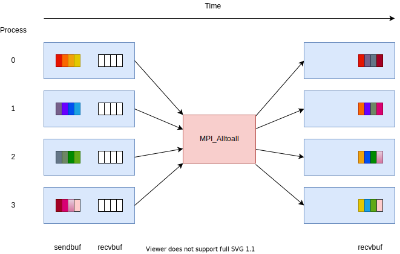

Generalized forms of gather
===========================

.. questions::

   - How can I do more complex rearrangements of data?

.. objectives::

   - Know that gather can be generalized
   - Know the difference between generalized forms of gather

All-gather
----------

An ``MPI_Allgather`` call gather the same data from all ranks and
provides it to all ranks. It is logically identical to ``MPI_Gather``
to a root followed by an ``MPI_Bcast`` from that root, but is
implemented more efficiently.

.. figure:: img/MPI_Allgather.svg
   :align: center

   After the call, all ranks have one value from each other rank in
   the communicator, ordered by rank number.

``MPI_Allgather`` is `blocking` and introduces `collective
synchronization` into the program. Note that there is no root
for this operation.

This can be useful to allow all ranks to collect values from all other
ranks in the communicator. For example, all ranks might compute some
values, and then all ranks gather that content to use it in a
subsequent stage.

.. signature:: |term-MPI_Allgather|

   Gathers data from all ranks and provides the same data to all ranks.

   .. code-block:: c

      int MPI_Allgather(const void *sendbuf, int sendcount, MPI_Datatype sendtype,
                        void *recvbuf, int recvcount, MPI_Datatype recvtype,
                        MPI_Comm comm)

.. parameters::

   All ranks receive the values send from each process.

   ``sendbuf``, ``sendcount`` and ``sendtype`` describe the buffer on
   **each** process from which the data is sent. Only a buffer large
   enough to contain the data sent by that process is needed.

   ``recvbuf``, ``recvcount`` and ``recvtype`` describe the buffer on
   **each** process to which the data is sent. A buffer large
   enough to receive all the data for that process is needed.

   All ranks in the communicator must participate with valid receive
   buffers and consistent counts and types.

All-to-all
----------

An ``MPI_Alltoall`` call gathers data from all ranks and provides
distinct data to all ranks. It is logically identical to making one
call to ``MPI_Gather`` for each possible root rank, but is implemented
more efficiently.

   After the call, all ranks have one value from each other rank in
   the communicator, ordered by rank number.

``MPI_Alltoall`` is `blocking` and introduces `collective
synchronization` into the program. Note that there is no root
for this operation.

This can be useful to allow all ranks to collect values from all other
ranks in the communicator. For example, a 3D Fast Fourier Transform
often uses an all-to-all operation to redistribute the working data
set for each process to a new dimension.

.. signature:: |term-MPI_Alltoall|

   Gathers data from all ranks and provides distinct data to all ranks.

   .. code-block:: c

      int MPI_Alltoall(const void *sendbuf, int sendcount, MPI_Datatype sendtype,
                       void *recvbuf, int recvcount, MPI_Datatype recvtype,
                       MPI_Comm comm)

.. parameters::

   All ranks receive a subset of the values sent from each process.

   ``sendbuf``, ``sendcount`` and ``sendtype`` describe the buffer on
   **each** process from which the data is sent. Only a buffer large
   enough to contain the data sent by that process is needed.

   ``recvbuf``, ``recvcount`` and ``recvtype`` describe the buffer on
   **each** process to which the data is sent. A buffer large
   enough to receive all the data for that process is needed.

   All ranks in the communicator must participate with valid receive
   buffers and consistent counts and types.

Exercise: all-gather and all-to-all
-----------------------------------

.. challenge:: Use all-gather

   You can find a scaffold for the code in the
   ``content/code/day-2/01_allgather`` folder.  A working solution is in the
   ``solution`` subfolder. Try to compile with::

        mpicc -g -Wall -std=c11 collective-communication-allgather.c -o collective-communication-allgather

   #. When you have the code compiling, try to run with::

        mpiexec -np 4 ./collective-communication-allgather

   #. Use clues from the compiler and the comments in the code to
      change the code so it compiles and runs. Try to get all ranks to
      report success :-)

.. solution::

   * One correct call is::

         MPI_Allgather(values_to_all_gather, 3, MPI_INT,
                       &all_gathered_values, 3, MPI_INT,
                       comm);

   * What happened if you mistakenly used 4 or 12 for the counts? Why?

.. challenge:: Use all-to-all

   You can find a scaffold for the code in the
   ``content/code/day-2/02_alltoall`` folder.  A working solution is in the
   ``solution`` subfolder. Try to compile with::

        mpicc -g -Wall -std=c11 collective-communication-alltoall.c -o collective-communication-alltoall

   2. When you have the code compiling, try to run with::

        mpiexec -np 4 ./collective-communication-alltoall

   3. Use clues from the compiler and the comments in the code to
      change the code so it compiles and runs. Try to get all ranks to
      report success :-)

.. solution::

   * One correct call is::

        MPI_Alltoall(values_to_all_to_all, 3, MPI_INT,
                     &result_values, 3, MPI_INT,
                     comm);

   * What happened if you mistakenly used 4 or 12 for the counts? Why?

Scatterv
--------

An ``MPI_Scatterv`` call scatters a buffer in parts to all ranks.
It uses ``sendcounts`` and ``displs`` to determine the number of
elements to be sent to each rank.

``MPI_Scatterv`` is `blocking` and introduces `collective
synchronization` into the program.

This can be useful to when we want to distribute different amount of
data to different processes.

.. signature:: MPI_Scatterv

   Scatters data in parts to all ranks.

   .. code-block:: c

      int MPI_Scatterv(const void *sendbuf, const int *sendcounts, const int *displs,
                       MPI_Datatype sendtype, void *recvbuf, int recvcount,
                       MPI_Datatype recvtype,
                       int root, MPI_Comm comm)

.. parameters::

   ``sendbuf``, ``sendcounts``, ``displs`` and ``sendtype`` describe the
   buffer on the root process from which the data is sent. ``sendcounts``
   is an integer array that holds the number of elements to be sent to
   each process. ``displs`` is an integer array that holds the 
   displacement of the elements to be sent to each process.

   ``recvbuf``, ``recvcount`` and ``recvtype`` describe the buffer on
   each process to which the data is sent. A buffer large
   enough to receive the data for that process is needed.

   All ranks in the communicator must participate with valid receive
   buffers and consistent counts and types.

Gatherv
-------

An ``MPI_Gatherv`` call gathers info with variable size from all
ranks. It uses ``recvcounts`` and ``displs`` to determine the number of
elements to be collected from each rank.

``MPI_Gatherv`` is `blocking` and introduces `collective
synchronization` into the program.

This can be useful to when we want to collect different amount of
data from different processes.

.. signature:: MPI_Gatherv

   Gathers data with variable size from all ranks.

   .. code-block:: c

      int MPI_Gatherv(const void *sendbuf, int sendcount, MPI_Datatype sendtype,
                      void *recvbuf, const int *recvcounts, const int *displs,
                      MPI_Datatype recvtype, int root, MPI_Comm comm)

.. parameters::

   ``sendbuf``, ``sendcount`` and ``sendtype`` describe the buffer on
   each process from which the data is collected.

   ``recvbuf``, ``recvcounts``, ``displs`` and ``recvtype`` describe the
   buffer on the root process on which the data is collected. ``recvcounts``
   is an integer array that holds the number of elements to be collected
   from each process. ``displs`` is an integer array that holds the 
   displacement of the elements to be collected from each process.

   All ranks in the communicator must participate. The root process 
   must have a valid receive buffer with consistent size and type.

Exercise: scatterv and gatherv
------------------------------

.. challenge:: Use scatterv and gatherv to compute matrix vector multiplication

   In this exercise we compute matrix vector multiplication using ``MPI_Scatterv``
   and ``MPI_Gatherv``. One would need to scatter the row vectors of the matrix
   to the individual processes, broadcast the vector, and then calculate the
   local contribution to the matrix vector product. After that the local
   contributions are collected to the root process to form the final result.

   .. figure:: img/mat-vec.png
      :align: center

      Matrix vector multiplication in parallel

   You can find a scaffold for the code in the
   ``content/code/day-2/03_scatterv-and-gatherv`` folder.
   A working solution is in the
   ``solution`` subfolder. Try to compile with::

        mpicc -g -Wall -std=c11 scatterv-and-gatherv.c -o scatterv-and-gatherv

   #. When you have the code compiling, try to run with different number of processes.

   #. Try to get the root rank to report success :-)

Final thoughts
--------------

There are further generalizations available in MPI (e.g.
combined scatter-gather). Check the existing
options before rolling your own or giving up!

See also
--------

* https://www.mcs.anl.gov/~thakur/sc17-mpi-tutorial/slides.pdf
* https://www.rookiehpc.com/mpi/docs/mpi_allgather.php
* https://www.rookiehpc.com/mpi/docs/mpi_alltoall.php

.. keypoints::

   - More complex distribution patterns are also optimized in MPI
