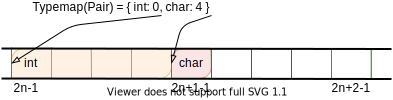
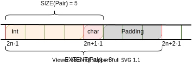
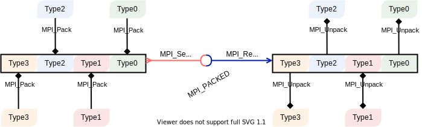
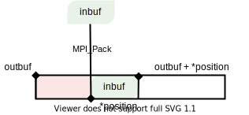
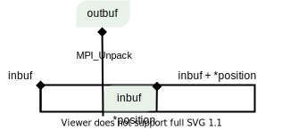

.. _derived-datatypes:

Derived datatypes
=================

.. questions::

   - How can you reduce the number of messages sent and received?
   - How can you use your own derived datatypes as content of messages?

.. objectives::

   - Understand how MPI handles datatypes.
   - Learn to send and receive composite messages
   - Learn how to represent homogeneous collections as MPI messages. |term-MPI_Type_contiguous|, |term-MPI_Type_vector|, |term-MPI_Type_indexed|
   - Learn how to represent your own derived datatypes as MPI messages with |term-MPI_Type_create_struct| and |term-MPI_Type_commit|

The ability to define custom datatypes is one of the hallmarks of a modern
programming language, since it allows programmers to structure their code in a
way that enhances readability and maintainability.
How can this be done in MPI? Recall that MPI is a standard describing a library
to enable parallel programming in the message passing model.

MPI supports many of the basic datatypes recognized by the C standard.

.. csv-table:: Basic datatypes in MPI and in the C standard. For a comprehensive
               explanation of the types defined in the C language, you can
               consult `this reference
               <https://en.cppreference.com/w/c/language/type>`_.
   :widths: auto
   :align: center
   :header-rows: 1
   :delim: ;

   MPI ; C
   ``MPI_CHAR`` ; ``signed char``
   ``MPI_FLOAT`` ; ``float``
   ``MPI_DOUBLE`` ; ``double``
   ``MPI_LONG_DOUBLE`` ; ``long double``
   ``MPI_WCHAR`` ; ``wchar_t``
   ``MPI_SHORT`` ; ``short``
   ``MPI_INT`` ; ``int``
   ``MPI_LONG`` ; ``long``
   ``MPI_LONG_LONG_INT`` ; ``long long``
   ``MPI_SIGNED_CHAR`` ; ``signed char``
   ``MPI_UNSIGNED_CHAR`` ; ``unsigned char``
   ``MPI_UNSIGNED_SHORT`` ; ``unsigned short``
   ``MPI_UNSIGNED`` ; ``unsigned int``
   ``MPI_UNSIGNED_LONG`` ; ``unsigned long``
   ``MPI_UNSIGNED_LONG_LONG`` ; ``unsigned long long``
   ``MPI_C_COMPLEX`` ; ``float _Complex``
   ``MPI_C_DOUBLE_COMPLEX`` ; ``double _Complex``
   ``MPI_C_LONG_DOUBLE_COMPLEX`` ; ``long double _Complex``
   ``MPI_PACKED`` ;
   ``MPI_BYTE`` ;

In the C language, types are **primitive** constructs: they
are *defined* by the standard and *enforced* by the compiler.
The MPI types are instead **variants** in the ``MPI_Datatype`` enumeration: they
appear as the **same** type to the compiler.
This is a fundamental difference which influences the way custom datatypes are handled.

In the C language, you would declare a ``struct`` such as the following:

.. code-block:: c

   struct Pair {
    int first;
    char second;
   };

``Pair`` is a new type. From the compiler's point of view, it has status on par
with the fundamental datatypes introduced above. The C standard mandates *how
to* represent this in memory and the compiler will generate machine code to
comply with it.

MPI does not know how to represent user-defined datatypes in memory by itself:

- How much memory does it need? Recall that MPI deals with **groups of
  processes**. For portability, you can *never* assume that two processes share
  the same architecture!
- How are the components of ``Pair`` laid out in memory? Are they always
  contiguous? Or are they padded?

The programmer needs to provide this low-level information, such that the MPI
runtime can send and receive custom  datatypes as messages over a heterogeneous
network of processes.

Representation of datatypes in MPI
----------------------------------

The representation of datatypes in MPI uses few low-level concepts.
The **type signature** of a custom datatypes is the list of its basic datatypes:

.. math::
   :label: eq:typesig

   \textrm{Typemap}[\texttt{T}] = [ \texttt{Datatype}_{0}, \ldots, \texttt{Datatype}_{n-1} ]

The **typemap** is the associative array (map) with datatypes, as understood by MPI, as
*keys* and displacements, in bytes, as *values*.

.. math::
   :label: eq:typemap

   \textrm{Typemap}[\texttt{T}] = \{ \texttt{Datatype}_{0}: \textrm{Displacement}_{0}, \ldots, \texttt{Datatype}_{n-1}: \textrm{Displacement}_{n-1} \}

The displacements are *relative* to the buffer the datatype describes.

Assuming that an ``int`` takes 4 bytes of memory, the typemap for our ``Pair``
datatype would be: :math:`\textrm{Typemap}[\texttt{Pair}] = \{ \texttt{int}: 0,
\texttt{char}: 4\}`. Note again that the displacements are *relative*.

   Depiction of the typemap for the ``Pair`` custom type. The displacements are
   always relative.

Knowledge of typemap and type signature is not enough for a full description of
the type to the MPI runtime: the underlying programming language might mandate
architecture-specific :term:`alignment` of the basic datatypes. The data
structure would then be laid out in memory incoherently with the displacements
in its typemap.
We need a few more concepts. Given a typemap :math:`m` we can define:

Lower bound
  The first byte occupied by the datatype.

  .. math::
     :label: eq:lowerbound

     \textrm{LB}[m] = \min_{j}[\textrm{Displacement}_{j}]

Upper bound
  The last byte occupied by the datatype.

  .. math::
     :label: eq:upperbound

     \textrm{UB}[m] = \max_{j}[\textrm{Displacement}_{j} + \texttt{sizeof}(\textrm{Datatype}_{j})] + \textrm{Padding}

Extent
  The amount of memory needed to represent the datatype, taking into account architecture-specific alignment.

  .. math::
     :label: eq:extent

     \textrm{Extent}[m] = \textrm{UB}[m] - \textrm{LB}[m]

The C language (and Fortran) *require* that the data occurs in memory at
well-defined addresses: the data needs to be aligned. The address, in bytes, of
any item must be a multiple of the size of that item in bytes. This is so-called
*natural alignment*.
For our ``Pair`` data structure the ``first`` element is an ``int`` and occupies
4 bytes. An ``int`` will align to 4 bytes boundaries: when allocating a new
``int`` in memory, the compiler will insert **padding** to reach the alignment
boundary.
Indeed, ``second`` is a ``char`` and requires just 1 byte. To insert yet another
``Pair`` item, we first need to reach the alignment boundary with a padding of 3
bytes.
Thus:

.. math::

   \begin{aligned}
     \textrm{LB}[\texttt{Pair}] &= \min_{j}[0, 4] = 0 \\
     \textrm{UB}[\texttt{Pair}] &= \max_{j}[0+4, 4+1] + 3 = 8 \\
     \textrm{Extent}[\texttt{Pair}] &= \textrm{UB}[\texttt{Pair}] - \textrm{LB}[\texttt{Pair}] = 8 \\
   \end{aligned}

   The relation between **size** and **extent** of a derived datatype in the
   case of the ``Pair``.
   We show the address alignment boundaries with
   vertical :red:`red` lines. The lowerbound of the custom datatype is 4:
   ``first`` can be found with an offset of 4 bytes after the starting address.
   Notice the 3 bytes of padding, necessary to achieve natural alignment of
   ``Pair``.  The upperbound is 8: the *next* item of type ``Pair`` can be found
   with an offset of 8 bytes after the previous element.
   The total size is 5 bytes, but the extent, which takes the padding into
   account, is 8 bytes.

MPI offers functions to query extent and size of its types: they all take a variant of the ``MPI_Datatype`` enumeration as argument.

.. signature:: |term-MPI_Type_get_extent|

   Returns the lower bound and extent of a type.

   .. code-block:: c

      int MPI_Type_get_extent(MPI_Datatype type,
                              MPI_Aint *lb,
                              MPI_Aint *extent)

.. parameters::

   ``type``
     The datatype whose extent we're querying.
   ``lb``
     The lower bound of the datatype. ``MPI_Aint`` is a type designed to hold any valid address.
   ``extent``
     The extent of the datatype. ``MPI_Aint`` is a type designed to hold any valid address.

.. signature:: |term-MPI_Type_size|

   Returns the number of bytes occupied by entries in the datatype.

   .. code-block:: c

      int MPI_Type_size(MPI_Datatype type,
                        int *size)

.. parameters::

   ``type``
     The datatype whose extent we're querying.
   ``size``
     The number of bytes occupied by the entries in the datatype.

.. typealong:: Extents and sizes

   We will now play around a bit with the compiler and MPI to gain further
   understanding of padding, alignment, extents, and sizes.

   #. What are extents and sizes for the basis datatypes ``char``, ``int``,
      ``float``, and ``double`` on your architecture? Do the numbers conform to
      your expectations? What is the result of ``sizeof`` for these types?

      .. code-block:: c

         // char
         printf("sizeof(char) = %ld\n", sizeof(char));
         MPI_Type_get_extent(MPI_CHAR, &.., &..);
         MPI_Type_size(MPI_CHAR, &..);
         printf("For MPI_CHAR:\n  lowerbound = %ld; extent = %ld; size = %d\n", ..,
                 .., ..);

      Download a :download:`working solution <code/basic-extent-size-solution.c>`

   #. Let's now look at the ``Pair`` data structure. We first need declare the
      data structure to MPI. The following code, which we will study
      in much detail later on, achieves the purpose:

      .. code-block:: c

         // build up the typemap for Pair
         // the type signature for Pair
         MPI_Datatype typesig[2] = {MPI_INT, MPI_CHAR};
         // how many of each type in a "block" of Pair
         int block_lengths[2] = {1, 1};
         // displacements of data members in Pair
         MPI_Aint displacements[2];
         // why not use pointer arithmetic directly?
         MPI_Get_address(&my_pair.first, &displacements[0]);
         MPI_Get_address(&my_pair.second, &displacements[1]);

         // create and commit the new type
         MPI_Datatype mpi_pair;
         MPI_Type_create_struct(2, block_lengths, displacements, typesig, &mpi_pair);
         MPI_Type_commit(&mpi_pair);

      What are the size and the extent? Do they match up with our pen-and-paper calculation?
      Try different combinations of datatypes and adding other fields to the ``struct``.

      Download a :download:`working solution <code/struct-extent-size-solution.c>`

Packing and unpacking
---------------------

MPI offers the possibility to pack and unpack data of known datatype into a
single contiguous memory buffer, *without* first having to define a
corresponding datatype.
This can be an extremely useful technique to reduce messaging traffic and could
help with the readability and portability of the code.
The resulting packed buffer will be of type ``MPI_PACKED`` and can contain any
sort of heterogeneous collection of basic datatypes recognized by MPI.

   MPI allows the programmer to communicate heterogeneous collections into a
   single message, without defining a full-fledged custom datatype. The data is
   packed into a buffer of type ``MPI_PACKED``. On the receiving end, the buffer
   will be unpacked into its constituent components.

.. signature:: |term-MPI_Pack|

   Pack data in noncontiguous memory to a contiguous memory buffer.

   .. code-block:: c

      int MPI_Pack(const void *inbuf,
                   int incount,
                   MPI_Datatype datatype,
                   void *outbuf,
                   int outsize,
                   int *position,
                   MPI_Comm comm)

   Schematic view of the relation between ``inbuf``, ``outbuf``, and the
   ``position`` input/output parameter.

.. parameters::

   ``inbuf``
     The input buffer, *i.e.* the data to be packed into contigous memory.
   ``incount``
     Number of input data items.
   ``datatype``
     The datatype of each item to be packed.
   ``outbuf``
     Starting address of the output buffer.
   ``outsize``
     The size, in bytes, of the output buffer.
   ``position``
     This is an input/output parameter:

     - In *input*, the data in ``inbuf`` will be copied at the address
       ``outbuf + *position``.
     - In *output*, it is the first location in ``outbuf`` *after* copying the
       data.

   ``comm``
     The communicator.

.. signature:: |term-MPI_Unpack|

   Unpack a contiguous memory buffer into noncontiguous memory locations.

   .. code-block:: c

      int MPI_Unpack(const void *inbuf,
                     int insize,
                     int *position,
                     void *outbuf,
                     int outcount,
                     MPI_Datatype datatype,
                     MPI_Comm comm)

   Schematic view of the relation between ``inbuf``, ``outbuf``, and the
   ``position`` input/output parameter.

.. parameters::

   ``inbuf``
     The input buffer, *i.e.* the data to be unpacked.
   ``insize``
     The size, in bytes, of the input buffer.
   ``position``
     This is an input/output parameter:

     - In *input*, the data in ``inbuf`` will be copied at the address
       ``outbuf + *position``.
     - In *output*, it is the first location in ``inbuf`` *after* copying the
       data.

   ``outbuf``
     Starting address of the output buffer.
   ``outcount``
     Number of output data items.
   ``datatype``
     The datatype of each item to be unpacked.
   ``comm``
     The communicator.

Both |term-MPI_Pack| and |term-MPI_Unpack|
What should ``outsize`` and ``insize`` be?

.. challenge::

   In the Pokémon trading card game, opponents face each in duels using their
   pokémons. The game is played in turns and at each turn a player can attack.
   We have to send:

   - The attacking pokémon's name: a ``char`` array.
   - How many life points it has: a ``double``.
   - The damage its attack will inflict: an ``int``.
   - A damage multiplier: a ``double``.

   .. tabs::

      .. tab:: Pack and unpack

         1. Download the :download:`scaffold source code <code/pokemon-pack-unpack.c>`.
            Open it and read through it.
         2. Pack the data in the ``message`` buffer.
         3. Unpack the ``message`` buffer into its component data.

         Compile with::

           mpicc -g -Wall -std=c11 pokemon-pack-unpack.c -o pokemon-pack-unpack

         - Why are we hardcoding the length of the pokémon's name?
         - What is the purpose of the ``position`` variable? Print its value
           after each packing and unpacking. Do these values conform with your
           intuition?
         - Should packing and unpacking happen in the same order? What happens if not?
         - What happens when there is a mismatch of types between packing and unpacking?

         Download a :download:`working solution <code/pokemon-pack-unpack-solution.c>`

      .. tab:: Bonus

         The ``message`` is a buffer of size ``BUFSIZ`` (defined in the standard
         header ``stdio.h``) We cannot always be sure this is the correct
         choice: the space might be plentiful, in which case we're wasting
         resource, or it might not be enough, in which case the program is not
         safe and likely not even portable!

         MPI offers the function ``MPI_Pack_size`` for this purpose. Look up its
         documentation and modify the source code such that the buffer is sized
         more appropriately.

         Download a :download:`working solution <code/pokemon-pack-unpack-size-solution.c>`

      .. tab:: Superbonus

         The length of the string holding the pokémon's name is hardcoded to a
         constant. How would you generalize this program?

Datatype constructors in MPI
----------------------------

- Contiguous types: |term-MPI_Type_contiguous|
- Extent-strided types: |term-MPI_Type_vector|
- Byte-strided types: |term-MPI_Type_create_hvector|
- Extent-indexed types: |term-MPI_Type_indexed|
- Byte-strided types: |term-MPI_Type_create_hindexed|
- General types: |term-MPI_Type_create_struct|
- Register and unregister your types: |term-MPI_Type_commit|, |term-MPI_Type_free|

   The lifecycle of user-defined datatypes in MPI. Calling any of the type
   constructors will create an object of type ``MPI_Datatype`` with the
   user-defined typemap. Before using this custom datatype in message passing,
   it needs to be published with |term-MPI_Type_commit|: the typemap is made
   known to the runtime, allowing it to handle messages of the new custom type.
   The programmer must take care to free the custom datatype object.

.. todo::

   - Draw diagram showing how new types are created and used: any of the type constuctors, |term-MPI_Type_commit|, use, |term-MPI_Type_free|
   - Type-along showing how to declare and use a contiguous type.
   - Type-along showing the use and meaning of extent and count. See 5.1.3 in :cite:`Gropp2014-qf`

See also
--------

* The lecture covering MPI datatypes from EPCC is available on `GitHub <https://github.com/EPCCed/archer2-MPI-2020-05-14/blob/master/slides/L10-derivedtypes.pdf>`_
* Chapter 5 of the **Using MPI** book by William Gropp *et al.* :cite:`Gropp2014-qf`
* Chapter 6 of the **Parallel Programming with MPI** book by Peter Pacheco. :cite:`Pacheco1997-qq`

.. keypoints::

   - A low-level representation as typemap can be associated with any derived data structure.
   - Typemaps are essential to enable MPI communication of complex datatypes.
