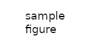

.. _derived-datatypes:

Derived datatypes
=================

.. questions::

   - How can you reduce the number of messages sent and received?
   - How can you use your own derived datatypes as content of messages?

.. objectives::

   - Understand how MPI handles datatypes.
   - Learn to send and receive composite messages
   - Learn how to represent homogeneous collections as MPI messages. |term-MPI_Type_contiguous|, |term-MPI_Type_vector|, |term-MPI_Type_indexed|
   - Learn how to represent your own derived datatypes as MPI messages with |term-MPI_Type_create_struct| and |term-MPI_Type_commit|

Representation of datatypes in MPI
----------------------------------

.. math::

   \textrm{Typemap} = \{ \textrm{Datatype}_{0}: \textrm{Displacement}_{0}, \ldots, \textrm{Datatype}_{n-1}: \textrm{Displacement}_{n-1} \}

.. math::

   \textrm{LB}(\textrm{Typemap}) = \min_{j}[\textrm{Displacement}_{j}]

.. math::

   \textrm{UB}(\textrm{Typemap}) = \max_{j}[\textrm{Displacement}_{j} + \texttt{sizeof}(\textrm{Datatype}_{j})] + \textrm{Padding}

.. math::

   \textrm{Extent}(\textrm{Typemap}) = \textrm{UB}(\textrm{Typemap}) - \textrm{LB}(\textrm{Typemap})

- ``MPI_Datatype`` and typemaps
- Type signature
- Lower bounds, upper bounds, extents
- Difference between *size* and *extent* of a datatype.
- Introduce |term-MPI_Type_get_extent| and |term-MPI_Type_size|

.. code-block:: c

   struct Pair {
    int first;
    char second;
   };

   The relation between size and extent of a derived data type for the case of the ``simple`` datatype.

.. todo::

   - Draw diagram showing how to calculate the extent from a typemap.
   - Type-along showing how to get extent and size of basis datatypes.

.. typealong:: Extents and sizes

   .. code-block:: c

      int LB = ... ;

Packing and unpacking
---------------------

MPI offers the possibility to pack and unpack data of the basic datatypes into a
single contiguous memory buffer, *without* first having to define a
corresponding datatype.
This can be an extremely useful technique to reduce messaging traffic and could
help with the readability and portability of the code.
The resulting packed buffer will be of type ``MPI_Packed`` and can contain any
sort of heterogeneous collection of basic datatypes recognized by MPI.

.. figure:: img/E01-pack_unpack.svg
   :align: center

   MPI allows the programmer to communicate heterogeneous collections into a
   single message, without defining a full-fledged custom datatype. The data is
   packed into a buffer of type ``MPI_PACKED``. On the receiving end, the buffer
   will be unpacked into its constituent components.

.. signature:: |term-MPI_Pack|

   Pack data in noncontiguous memory to a contiguous memory buffer.

   .. code-block:: c

      int MPI_Pack(const void *inbuf,
                   int incount,
                   MPI_Datatype datatype,
                   void *outbuf,
                   int outsize,
                   int *position,
                   MPI_Comm comm)

.. parameters::

   ``inbuf``
     The input buffer, *i.e.* the data to be packed into contigous memory.
   ``incount``
     Number of input data items.
   ``datatype``
     The datatype of each item to be packed.
   ``outbuf``
     Starting address of the output buffer.
   ``outsize``
     The size, in bytes, of the output buffer.
   ``position``
     This is an input/output parameter:

     - In *input*, the data in ``inbuf`` will be copied at the address
       ``outbuf + *position``.
     - In *output*, it is the first location in ``outbuf`` *after* copying the
       data.

   ``comm``
     The communicator.

.. signature:: |term-MPI_Unpack|

   Unpack a contiguous memory buffer into noncontiguous memory locations.

   .. code-block:: c

      int MPI_Unpack(const void *inbuf,
                     int insize,
                     int *position,
                     void *outbuf,
                     int outcount,
                     MPI_Datatype datatype,
                     MPI_Comm comm)

.. parameters::

   ``inbuf``
     The input buffer, *i.e.* the data to be unpacked.
   ``insize``
     The size, in bytes, of the input buffer.
   ``position``
     This is an input/output parameter:

     - In *input*, the data in ``inbuf`` will be copied at the address
       ``outbuf + *position``.
     - In *output*, it is the first location in ``inbuf`` *after* copying the
       data.

   ``outbuf``
     Starting address of the output buffer.
   ``outcount``
     Number of output data items.
   ``datatype``
     The datatype of each item to be unpacked.
   ``comm``
     The communicator.

What should ``outsize`` and ``insize`` be?

.. todo::

   - pack/unpack send your address. Gotchas: strings need to be statically sized and the size sent separately!

Datatype constructors in MPI
----------------------------

- Contiguous types: |term-MPI_Type_contiguous|
- Extent-strided types: |term-MPI_Type_vector|
- Byte-strided types: |term-MPI_Type_create_hvector|
- Extent-indexed types: |term-MPI_Type_indexed|
- Byte-strided types: |term-MPI_Type_create_hindexed|
- General types: |term-MPI_Type_create_struct|
- Register and unregister your types: |term-MPI_Type_commit|, |term-MPI_Type_free|

.. figure:: img/E01-type-life-cycle.svg
   :align: center

   The lifecycle of user-defined datatypes in MPI. Calling any of the type
   constructors will create an object of type ``MPI_Datatype`` with the
   user-defined typemap. Before using this custom datatype in message passing,
   it needs to be published with |term-MPI_Type_commit|: the typemap is made
   known to the runtime, allowing it to handle messages of the new custom type.
   The programmer must take care to free the custom datatype object.

.. todo::

   - Draw diagram showing how new types are created and used: any of the type constuctors, |term-MPI_Type_commit|, use, |term-MPI_Type_free|
   - Type-along showing how to declare and use a contiguous type.
   - Type-along showing the use and meaning of extent and count. See 5.1.3 in :cite:`Gropp2014-qf`

See also
--------

* The lecture covering MPI datatypes from EPCC is available on `GitHub <https://github.com/EPCCed/archer2-MPI-2020-05-14/blob/master/slides/L10-derivedtypes.pdf>`_
* Chapter 5 of the **Using MPI** book by William Gropp *et al.* :cite:`Gropp2014-qf`
* Chapter 6 of the **Parallel Programming with MPI** book by Peter Pacheco. :cite:`Pacheco1997-qq`

.. keypoints::

   - A low-level representation as typemap can be associated with any derived data structure.
   - Typemaps are essential to enable MPI communication of complex data types.
