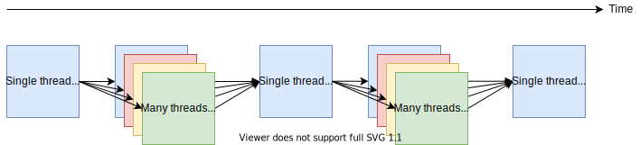
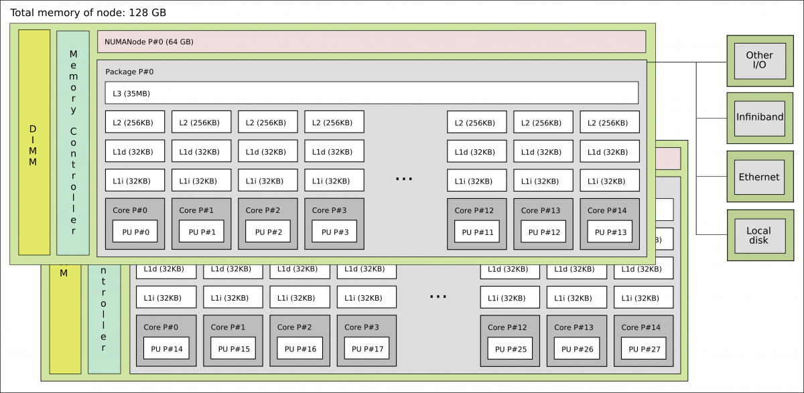

MPI and threads in practice
===========================

.. questions::

   - When should I consider writing hybrid MPI+OpenMP programs?
   - What should I look out for when writing hybrid MPI+OpenMP programs?

.. objectives::

   - Know to estimate the benefits before trying to write code for hybrid parallelism

Using fork-join parallelism
---------------------------

In fork-join parallelism, multiple threads are launched to collaborate
on work. Typically regions of parallelism alternate with regions where
only one thread works. This enables parallelism to be introduced
gradually, and only where profiling shows that it would be most
beneficial. In typical implementations, threads are kept idle between
parallel regions; this is more efficient than creating and destroying
them many times.

   OpenMP is particularly suited for fork-join parallelism. Beware
   that each parallel region requires synchronization between threads,
   which can be costly. Further, the speed-up depends critically on
   the time spent in the single-threaded regions!

The simplest hybrid approach is often to do the MPI communication in
the regions that are single-threaded.

   Fork-join parallelism is a natural fit for ``MPI_THREAD_FUNNELED``
   where fairly simple code can be improved with thread parallelism.

``for`` loops in Fortan/C/C++ can be readily parallelised with ``#pragma
omp parallel``, so applications that already use MPI outside such loops
can be converted to hybrid parallelism fairly easily.

.. challenge::

   You can find a scaffold for the code in the
   ``content/code/day-4/01_threading-funneled`` folder.  A working solution is
   in the ``solution`` subfolder. It is quite similar to that for the earlier
   non-blocking code-along exercise. Try to compile with::

        mpicc -g -fopenmp -Wall -std=c11 threading-funneled.c -o threading-funneled

   #. When you have the code compiling, try to run with::

        mpiexec -np 2 ./threading-funneled

   #. Try to fix the code so that it compiles, runs, and reports success

.. solution::

   * One correct approach is::

        int provided, required = MPI_THREAD_FUNNELED;
        MPI_Init_thread(NULL, NULL, required, &provided);
        /* ... */
        int local_work[] = {2, 3};
        /* ... */
        compute_row(local_work[k], working_data_set, next_working_data_set);
        /* ... */
        int non_local_work[] = {1, 4};
        /* ... */
        compute_row(non_local_work[k], working_data_set, next_working_data_set);

Using OpenMP tasking with MPI
-----------------------------

.. figure:: img/stencil-with-tasking.svg
   :align: center

   Stencil code with halo exchange implemented with OpenMP
   tasking. One group of threads takes responsibility for the halo
   exchange and non-local stencil work. Another takes responsibility
   for the local work. The threads are split statically during each
   time step, but how many threads to assign to each part might be
   able to be tuned over the duration of the program.

.. challenge::

   You can find a scaffold for the code in the
   ``content/code/day-4/02_threading-multiple`` folder.  A working solution is in the
   ``solution`` subfolder. Try to compile with::

        mpicc -g -fopenmp -Wall -std=c11 threading-multiple.c -o threading-multiple

   #. When you have the code compiling, try to run with::

        OMP_NUM_THREADS=4 mpiexec -np 2 ./threading-multiple

   #. Unfortunately I haven't found the last bug in my use of OpenMP tasking,
      but you can see the kind of approach that can work, and the complexity
      it entails. Do this only when you really need to!

Setting the proper thread affinity
----------------------------------

Setting the affinity or the preferred location of threads in the hardware
is crucial for the performance of hybrid MPI+OpenMP applications specially in
modern architectures which are composed of several non-uniform memory access (NUMA)
nodes. 

   Kebnekaise architecture contains two NUMA nodes and 14 cores per NUMA node.
   Also several levels of cache L1,L2, and L3 can be seen in this architecture.

In addition to the physical cores (28 per node on Kebnekaise), logical cores could be
available in your system but this option is usually turned-off in HPC systems.
In the case of Kebnekaise, only one thread can run on a physical core:

.. signature:: |System information|

   .. code-block:: c

      lscpu | grep -i 'core\|thread\|Socket'
      Thread(s) per core:              1
      Core(s) per socket:              14
      Socket(s):                       2

Without specifying the location of threads, the OS decides where the threads
are placed. Binding of OpenMP threads can be controlled with the enviroment variables:

.. signature:: ``OMP_PROC_BIND``

   .. code-block:: c

      OMP_PROC_BIND=false,true,close,primary,spread

   .. parameters::

      ``true`` and ``false`` values tell the OS that threads are fixed or they
      are can move to a different core, respectively. ``primary`` will place all the threads
      on the same core where the primary thread for each rank will run. ``close`` and ``spread``
      are used to place the threads close to each other or well separated, respectively. 

.. signature:: ``OMP_PLACES``

   .. code-block:: c

      OMP_PLACES=cores,threads,sockets

   .. parameters::

      ``cores`` denotes a physical core location, ``threads`` is used to bind to hyperthreads 
      (if available), and ``sockets`` is used to denote a single socket per thread.

There are several programs available that allow you to see the binding
scheme that is being used for instance the ``xthi.c`` program from HPE(Cray) cited
at the bottom of this page.

.. challenge::

   Download the ``xthi.c`` code and compile it with::

        mpicc -fopenmp -Wall -std=c11 xthi.c -o xthi_exe

   #. When you have the code compiling, try to run with::

        export OMP_NUM_THREADS=(Nr. threads)
        export OMP_DISPLAY_ENV=true
        mpiexec -np (Nr. MPI ranks) ./xthi_exe | sort -n -k 4 -k 6

   #. You should set the Nr. threads and MPI ranks so that their product don't
      exceed the number of physical cores in your system. The variable ``OMP_DISPLAY_ENV``
      can be used to see the value of the OpenMP environment variables.

.. solution::

   * The output in the case of Kebnekaise looks like::

        OPENMP DISPLAY ENVIRONMENT BEGIN
           _OPENMP='201611'
          [host] OMP_AFFINITY_FORMAT='OMP: pid %P tid %i thread %n bound to OS proc set {%A}'
          [host] OMP_ALLOCATOR='omp_default_mem_alloc'
          [host] OMP_CANCELLATION='FALSE'
          [host] OMP_DEBUG='disabled'
          [host] OMP_DEFAULT_DEVICE='0'
          [host] OMP_DISPLAY_AFFINITY='TRUE'
          [host] OMP_DISPLAY_ENV='TRUE'
          [host] OMP_DYNAMIC='FALSE'
          [host] OMP_MAX_ACTIVE_LEVELS='1'
          [host] OMP_MAX_TASK_PRIORITY='0'
          [host] OMP_NESTED: deprecated; max-active-levels-var=1
          [host] OMP_NUM_TEAMS='0'
          [host] OMP_NUM_THREADS='7'
          ``[host] OMP_PLACES: value is not defined``
          ``[host] OMP_PROC_BIND='false'``
          [host] OMP_SCHEDULE='static'
          [host] OMP_STACKSIZE='4M'
          [host] OMP_TARGET_OFFLOAD=DEFAULT
          [host] OMP_TEAMS_THREAD_LIMIT='0'
          [host] OMP_THREAD_LIMIT='2147483647'
          [host] OMP_TOOL='enabled'
          [host] OMP_TOOL_LIBRARIES: value is not defined
          [host] OMP_TOOL_VERBOSE_INIT: value is not defined
          [host] OMP_WAIT_POLICY='PASSIVE'
        OPENMP DISPLAY ENVIRONMENT END 
        Hello from rank 0, thread 1, on b-cn1045.hpc2n.umu.se. (core affinity = 0-6)
        Hello from rank 0, thread 2, on b-cn1045.hpc2n.umu.se. (core affinity = 0-6)
        Hello from rank 0, thread 3, on b-cn1045.hpc2n.umu.se. (core affinity = 0-6)
        Hello from rank 0, thread 4, on b-cn1045.hpc2n.umu.se. (core affinity = 0-6)
        Hello from rank 0, thread 5, on b-cn1045.hpc2n.umu.se. (core affinity = 0-6)
        Hello from rank 0, thread 6, on b-cn1045.hpc2n.umu.se. (core affinity = 0-6)
        Hello from rank 1, thread 0, on b-cn1045.hpc2n.umu.se. (core affinity = 7-13)
        Hello from rank 1, thread 1, on b-cn1045.hpc2n.umu.se. (core affinity = 7-13)
        Hello from rank 1, thread 2, on b-cn1045.hpc2n.umu.se. (core affinity = 7-13)
        Hello from rank 1, thread 3, on b-cn1045.hpc2n.umu.se. (core affinity = 7-13)
        Hello from rank 1, thread 4, on b-cn1045.hpc2n.umu.se. (core affinity = 7-13)
        Hello from rank 1, thread 5, on b-cn1045.hpc2n.umu.se. (core affinity = 7-13)
        Hello from rank 1, thread 6, on b-cn1045.hpc2n.umu.se. (core affinity = 7-13)
        Hello from rank 2, thread 0, on b-cn1045.hpc2n.umu.se. (core affinity = 14-20)
        Hello from rank 2, thread 1, on b-cn1045.hpc2n.umu.se. (core affinity = 14-20)
        Hello from rank 2, thread 2, on b-cn1045.hpc2n.umu.se. (core affinity = 14-20)
        Hello from rank 2, thread 3, on b-cn1045.hpc2n.umu.se. (core affinity = 14-20)
        Hello from rank 2, thread 4, on b-cn1045.hpc2n.umu.se. (core affinity = 14-20)
        Hello from rank 2, thread 5, on b-cn1045.hpc2n.umu.se. (core affinity = 14-20)
        Hello from rank 2, thread 6, on b-cn1045.hpc2n.umu.se. (core affinity = 14-20)
        Hello from rank 3, thread 0, on b-cn1045.hpc2n.umu.se. (core affinity = 21-27)
        Hello from rank 3, thread 1, on b-cn1045.hpc2n.umu.se. (core affinity = 21-27)
        Hello from rank 3, thread 2, on b-cn1045.hpc2n.umu.se. (core affinity = 21-27)
        Hello from rank 3, thread 3, on b-cn1045.hpc2n.umu.se. (core affinity = 21-27)
        Hello from rank 3, thread 4, on b-cn1045.hpc2n.umu.se. (core affinity = 21-27)
        Hello from rank 3, thread 5, on b-cn1045.hpc2n.umu.se. (core affinity = 21-27)
        Hello from rank 3, thread 6, on b-cn1045.hpc2n.umu.se. (core affinity = 21-27)

     In this case, the OS has the freedom to decide the location of threads
     (``OMP_PROC_BIND='false'``). For instance, threads 0-6 of the rank 0 can move accross
     cores 0-6 during a simulation.

.. challenge::

   #. Export the variables for binding affinity and run the ``xthi.c`` code::

        export OMP_NUM_THREADS=(Nr. threads)
        export OMP_DISPLAY_ENV=true
        export OMP_PROC_BIND=close
        export OMP_PLACES=cores
        mpiexec -np (Nr. MPI ranks) ./xthi_exe | sort -n -k 4 -k 6

   #. You should set the Nr. threads and MPI ranks so that their product don't
      exceed the number of physical cores in your system. The variable ``OMP_DISPLAY_ENV``
      can be used to see the value of the OpenMP environment variables.

   #. Compare this output with the one of the previous exercise. Where are the threads placed?

.. solution::

   * The output in the case of Kebnekaise looks like::

        OPENMP DISPLAY ENVIRONMENT BEGIN
           _OPENMP='201611'
          [host] OMP_AFFINITY_FORMAT='OMP: pid %P tid %i thread %n bound to OS proc set {%A}'
          [host] OMP_ALLOCATOR='omp_default_mem_alloc'
          [host] OMP_CANCELLATION='FALSE'
          [host] OMP_DEBUG='disabled'
          [host] OMP_DEFAULT_DEVICE='0'
          [host] OMP_DISPLAY_AFFINITY='TRUE'
          [host] OMP_DISPLAY_ENV='TRUE'
          [host] OMP_DYNAMIC='FALSE'
          [host] OMP_MAX_ACTIVE_LEVELS='1'
          [host] OMP_MAX_TASK_PRIORITY='0'
          [host] OMP_NESTED: deprecated; max-active-levels-var=1
          [host] OMP_NUM_TEAMS='0'
          [host] OMP_NUM_THREADS='7'
          ``[host] OMP_PLACES='cores'``
          ``[host] OMP_PROC_BIND='close'``
          [host] OMP_SCHEDULE='static'
          [host] OMP_STACKSIZE='4M'
          [host] OMP_TARGET_OFFLOAD=DEFAULT
          [host] OMP_TEAMS_THREAD_LIMIT='0'
          [host] OMP_THREAD_LIMIT='2147483647'
          [host] OMP_TOOL='enabled'
          [host] OMP_TOOL_LIBRARIES: value is not defined
          [host] OMP_TOOL_VERBOSE_INIT: value is not defined
          [host] OMP_WAIT_POLICY='PASSIVE'
        OPENMP DISPLAY ENVIRONMENT END
        Hello from rank 0, thread 1, on b-cn0516.hpc2n.umu.se. (core affinity = 1)
        Hello from rank 0, thread 2, on b-cn0516.hpc2n.umu.se. (core affinity = 2)
        Hello from rank 0, thread 3, on b-cn0516.hpc2n.umu.se. (core affinity = 3)
        Hello from rank 0, thread 4, on b-cn0516.hpc2n.umu.se. (core affinity = 4)
        Hello from rank 0, thread 5, on b-cn0516.hpc2n.umu.se. (core affinity = 5)
        Hello from rank 0, thread 6, on b-cn0516.hpc2n.umu.se. (core affinity = 6)
        Hello from rank 1, thread 0, on b-cn0516.hpc2n.umu.se. (core affinity = 7)
        Hello from rank 1, thread 1, on b-cn0516.hpc2n.umu.se. (core affinity = 8)
        Hello from rank 1, thread 2, on b-cn0516.hpc2n.umu.se. (core affinity = 9)
        Hello from rank 1, thread 3, on b-cn0516.hpc2n.umu.se. (core affinity = 10)
        Hello from rank 1, thread 4, on b-cn0516.hpc2n.umu.se. (core affinity = 11)
        Hello from rank 1, thread 5, on b-cn0516.hpc2n.umu.se. (core affinity = 12)
        Hello from rank 1, thread 6, on b-cn0516.hpc2n.umu.se. (core affinity = 13)
        Hello from rank 2, thread 0, on b-cn0516.hpc2n.umu.se. (core affinity = 14)
        Hello from rank 2, thread 1, on b-cn0516.hpc2n.umu.se. (core affinity = 15)
        Hello from rank 2, thread 2, on b-cn0516.hpc2n.umu.se. (core affinity = 16)
        Hello from rank 2, thread 3, on b-cn0516.hpc2n.umu.se. (core affinity = 17)
        Hello from rank 2, thread 4, on b-cn0516.hpc2n.umu.se. (core affinity = 18)
        Hello from rank 2, thread 5, on b-cn0516.hpc2n.umu.se. (core affinity = 19)
        Hello from rank 2, thread 6, on b-cn0516.hpc2n.umu.se. (core affinity = 20)
        Hello from rank 3, thread 0, on b-cn0516.hpc2n.umu.se. (core affinity = 21)
        Hello from rank 3, thread 1, on b-cn0516.hpc2n.umu.se. (core affinity = 22)
        Hello from rank 3, thread 2, on b-cn0516.hpc2n.umu.se. (core affinity = 23)
        Hello from rank 3, thread 3, on b-cn0516.hpc2n.umu.se. (core affinity = 24)
        Hello from rank 3, thread 4, on b-cn0516.hpc2n.umu.se. (core affinity = 25)
        Hello from rank 3, thread 5, on b-cn0516.hpc2n.umu.se. (core affinity = 26)
        Hello from rank 3, thread 6, on b-cn0516.hpc2n.umu.se. (core affinity = 27)

     Notice that now the threads are placed on different cores. 

Tips for implementing hybrid MPI+OpenMP
---------------------------------------

* Demonstrate that you need more scaling to solve the problem.
  
* Know why you're adding hybrid parallelism... to access more memory,
  improve performance, reduce communication or a combination?

* Estimate how much improvement is available, based on existing performance
  measurements, e.g. profiling to find bottlenecks. If you don't know how,
  learn. Access to quality tools at HPC clusters are worth it!

* Are your external libraries using threading? How should you manage them?

* You have to introduce effective OpenMP parallelism to 90% of the
  execution time to get a good result.

* Start with master-only or funneled style. Migrate later if
  measurements suggest it.

* Initialize data structures inside OpenMP regions, to take advantage of
  "first-touch" policies needed with NUMA nodes.

* Make use of OpenMP’s conditional compilation features to ensure that
  the application can still be built without OpenMP.

* If the application makes use of derived datatypes to pack/unpack
  noncontiguous data, consider replacing these with user-level
  pack/unpack routines which can be parallelised with OpenMP.

* Learn about and use the OpenMP environment variables well

* Learn how to use the MPI launcher to place the ranks and their
  threads well. This is different for different applications.

See also
--------

* `Hybrid MPI-OpenMP best practices <http://www.intertwine-project.eu/sites/default/files/images/INTERTWinE_Best_Practice_Guide_MPI%2BOpenMP_1.2.pdf>`_
* `Kebnekaise <https://www.hpc2n.umu.se/resources/hardware/kebnekaise>`_
* `xthi.c code <https://support.hpe.com/hpesc/public/docDisplay?docLocale=en_US&docId=a00114008en_us&page=Run_an_OpenMP_Application.html>`_
* `OpenMPI API specification 5.2 <https://www.openmp.org/wp-content/uploads/OpenMP-API-Specification-5-2.pdf>`_

.. keypoints::

   - Fork-join parallelism with ``MPI_THREAD_FUNNELED`` is a cheap way to get improvements, but the benefit is limited
   - More complex multi-threading can do a better job of overlapping communication and computation
