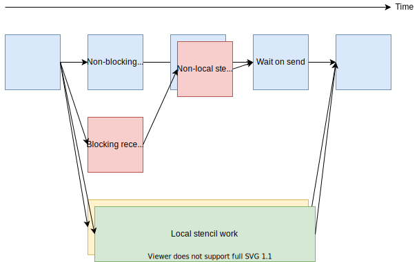

MPI and threads in practice
===========================

.. questions::

   - When should I consider writing hybrid MPI+OpenMP programs?
   - What should I look out for when writing hybrid MPI+OpenMP programs?

.. objectives::

   - Know to estimate the benefits before trying to write code for hybrid parallelism

Using fork-join parallelism
---------------------------

.. figure:: img/fork-join-parallelism.svg
   :align: center

   OpenMP is particularly suited for fork-join parallelism. Beware
   that each parallel region requires synchronization between threads,
   which can be costly. Further, the speed-up depends critically on
   the time spent in the single-threaded regions!

Imagine if a halo-exchange application like that from :ref:`an earlier
lesson <non-blocking-communication-pt1:Stencil application example>`
was implemented in these two ways. The pure-MPI solution has a much
larger volume of data in the border and halo regions. That means more
data must be sent in total, as well as more messages between pairs of
MPI ranks. In the hybrid case, both are reduced. However, the hybrid
solution can have other challenges, including code complexity, usage
complexity, synchronization, and avoiding problematic sharing.

.. figure:: img/fork-join-with-mpi.svg
   :align: center

   Fork-join parallelism is a natural fit for ``MPI_THREAD_FUNNELED``
   where fairly simple code can be improved with thread parallelism.

One hybrid approach that is quite simple to code is fork-join. `for`
loops in Fortan/C/C++ can be readily parallelised with `#pragma omp
parallel`

Using OpenMP tasking with MPI
-----------------------------

   Stencil code with halo exchange implemented with OpenMP
   tasking. One group of threads takes responsibility for the halo
   exchange and non-local stencil work. Another takes responsibility
   for the local work. The threads are split statically during each
   time step, but how many threads to assign to each part might be
   able to be tuned over the duration of the program.

Topic introduction here

You really want to browse this page alongside the source of it, to see
how this is implemented.  See the links at the to right of the page.

See also
--------

* `Hybrid MPI-OpenMP best practices <http://www.intertwine-project.eu/sites/default/files/images/INTERTWinE_Best_Practice_Guide_MPI%2BOpenMP_1.2.pdf>`_

.. keypoints::

   - Fork-join parallelism with ``MPI_THREAD_FUNNELED`` is a cheap way to get improvements, but the benefit is limited
   - More complex multi-threading can do a better job of overlapping communication and computation
