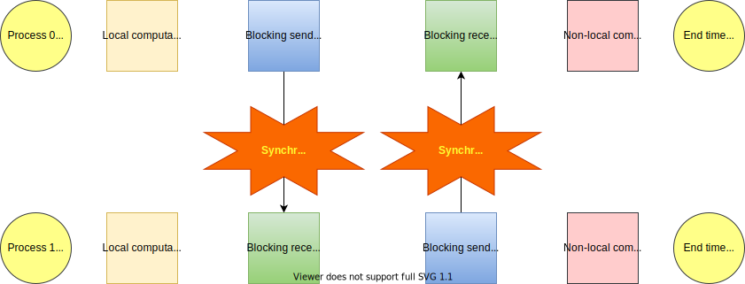
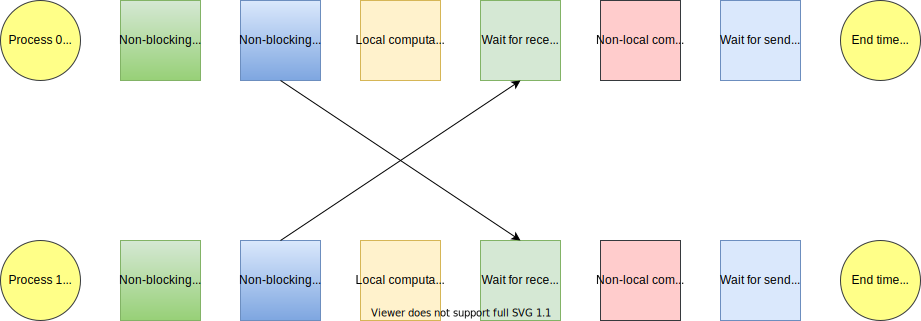

Non-blocking point-to-point
===========================

.. questions::

    - Does blocking communication scale well?
    - Can my code do useful work while waiting for messages?

.. objectives::

   - Understand that messages can lead to deadlocks
   - Implement an efficient stencil halo exchange

Introduction
------------

Communication operations take time to happen. Most of that time
doesn't need the CPU to participate, particularly if the network
hardware is good. Many applications have work to do on the data they
already have available in the local process, and then work to do on
data that arrives in a message. Likewise, they often need to have sent
data for other processes to use later.

These messages can be sent synchronously using the point-to-point
message types we already learned about. However the synchronization
takes time, and this limits how far one can parallelise.

Stencil application example
---------------------------

Stencils are a kind of computational kernel often used in PDE solvers.
A simple example is a diffusive heat-flow model, where the amount of
heat in a location at the next point in time depends on the amount of
heat currently present there, and the amounts in the nearest neighbour
locations.

.. figure:: img/StencilApplication.svg
   :align: center

   The model of the problem uses an 8x8 grid of data in light blue,
   which has to be updated based on the indicated 5-point stencil in
   light green to move from one time point to another.

Let us assume the grid is periodic, ie. the left-hand edge is adjacent
to the right-hand edge (like the video game Space Invaders!), and
likewise top and bottom. Such a grid models a torus. In order to
update the amount of heat at every location, all the amount of heat at
all four of its neighbours must also be known locally. That's
straightforward when using a single process, because everything is
local. But what happens when using two ranks?
   

   The two processes share the data evenly, in a 4x8 local data set
   shown in light blue.  In order to compute the heat at the next time
   step, the required data set is larger than this, shown in yellow.

The required data to the left and right of the local data set is easy,
because that data is already present locally, just on the other side
of the local data set. However the top and bottom yellow data has to
come from the other process.

.. figure:: img/Workingdatasets.svg
   :align: center

   The ``border data`` in dark blue has to be sent to the other
   process, and the ``ghost data`` or ``halo data`` in dark green is
   received from the other process.

Non-performant MPI workflows for stencil applications: blocking messages
------------------------------------------------------------------------

A possible workflow for the code on these two processes looks like

.. figure:: img/simplestencilworkflow.svg
   :align: center

   A simple parallel stencil-computation workflow. Depending on the
   MPI implementation, doing the send first on both ranks can lead to
   a deadlock.

This may work sometimes, but it also might not if the buffers or
number of messages gets large enough. Such code will not be
portable.

   A correct ring-style parallel stencil-computation workflow.

This workflow will always work. This approach generalizes to larger
rings, so long as alternating processes either send or respectively
receive first. It also generalizes to multiple dimensions. However, it
still requires synchronization between send and receive ranks. That
synchronization is problematic when the time to send messages is
comparable with either the amounts of compute work involved, or the
variation in those amounts.

Performant MPI workflows for stencil applications: non-blocking messages
------------------------------------------------------------------------

   A correct non-blocking-style parallel stencil-computation
   workflow. The MPI implementation may be able to do the
   communication overlapped with the computation.

This will also always work. It may be more efficient than the
ring-style approach, but that depends on the implementation and
environment, as well as the size of messages and amounts of compute
that can participate in the overlapped region.

The user is responsible for not using the memory area until after the
message request has been waited upon.

Non-blocking MPI send calls
---------------------------

An |term-MPI_Isend| creates a send request and returns a request
object. It may or may not have sent the message, or buffered it. The
caller is responsible for not changing the buffer until after waiting
upon the resulting request object.

.. signature:: |term-MPI_Isend|

   .. code-block:: c

       int MPI_Isend(const void* buf,
                     int count,
                     MPI_Datatype datatype,
                     int dest,
                     int tag,
                     MPI_Comm comm,
                     MPI_Request *request)

.. parameters::

   ``buf``, ``count`` and ``datatype`` describe the buffer to be sent
   to ``dest`` rank of ``comm`` using tag ``tag``. The ``request`` object
   that is returned must be used to wait on the communication later.

Other calls exist for other sending modes familiar to you from
point-to-point messages, including buffered, synchronous, and
ready-mode sends. They are listed in the table below, along with
links for more information.

.. table:: Point-to-point communication functions
   :widths: auto

   +------------------------+------------------------+------------------+-------------------+
   |                                                 |             Communication            |
   +                                                 +------------------+-------------------+
   |                                                 | Blocking         | Non-blocking      |
   +========================+========================+==================+===================+
   |                        | **Standard**           | |term-MPI_Send|  | |term-MPI_Isend|  |
   +                        +------------------------+------------------+-------------------+
   | **Mode**               | **Synchronous**        | |term-MPI_Ssend| | ``MPI_Issend``    |
   +                        +------------------------+------------------+-------------------+
   |                        | **Ready**              | ``MPI_Rsend``    | ``MPI_Irsend``    |
   +                        +------------------------+------------------+-------------------+
   |                        | **Buffered**           | ``MPI_Bsend``    | ``MPI_Ibsend``    |
   +------------------------+------------------------+------------------+-------------------+

Non-blocking MPI receive call
-----------------------------

An |term-MPI_Irecv| creates a receive request and returns a receive
request in an ``MPI_Request`` object. The caller is responsible for
not changing the buffer until after waiting upon the resulting request
object.

.. signature:: |term-MPI_Irecv|

   .. code-block:: c

      int MPI_Irecv(void* buf,
                    int count,
                    MPI_Datatype datatype,
                    int source,
                    int tag,
                    MPI_Comm comm,
                    MPI_Request *request)

.. parameters::

   ``buf``, ``count`` and ``datatype`` describe the buffer to be
   received from ``source`` rank of ``comm`` using tag ``tag``. The
   ``request`` object that is returned must be used to wait on the
   communication later.

An |term-MPI_Irecv| can be used to match any kind of send, regardless of
sending mode or blocking status.

Waiting for non-blocking call completion
----------------------------------------

An |term-MPI_Wait| call waits for completion of the operation that
created the request object passed to it. For a send, the semantics of
the sending mode have been fulfilled (not necessarily that the message
has been received). For a receive, the buffer is now valid for use,
however the send has not necessarily completed (though obviously has
been initiated).

.. signature:: |term-MPI_Wait|

   .. code-block:: c

      int MPI_Wait(MPI_Request *request,
                   MPI_Status *status)

.. parameters::

   ``request`` describes the operation to be waited upon. ``status``
   returns the status of that operation. If the status is not needed,
   pass ``MPI_STATUS_IGNORE``.

It can be efficient to wait on any one, some, or all of a set of
operations before returning. MPI provides |term-MPI_Waitany|,
|term-MPI_Waitsome|, and |term-MPI_Waitall| for these use cases. For example,
waiting for any request to complete may allow the caller to continue
with related computation while waiting for other requests to complete.

Testing for non-blocking call completion
----------------------------------------

An |term-MPI_Test| call returns immediately a flag value indicating
whether a corresponding |term-MPI_Wait| would return immediately.

.. signature:: |term-MPI_Test|

   .. code-block:: c

      int MPI_Test(MPI_Request *request, int *flag, MPI_Status *status)

.. parameters::

   ``request`` describes the operation to be waited upon. ``status``
   returns the status of that operation. If the status is not needed,
   pass ``MPI_STATUS_IGNORE``. The value returned in ``flag`` indicates
   whether the operation is complete (ie a corresponding wait will
   return immediately).

It can be efficient to test any one, some, or all of a set of
operations before returning. MPI provides |term-MPI_Testany|,
|term-MPI_Testsome|, and |term-MPI_Testall| for these use cases. For
example, testing for any request completed may allow the caller to
continue with unrelated computation because no message with work has
yet arrived.

.. challenge:: Observe a deadlock in a non-blocking stencil application

   You can find a scaffold for the code in the
   ``content/code/day-2/04_deadlock`` folder.  A working solution is in the
   ``solution`` subfolder. Try to compile with::

        mpicc -g -Wall -std=c11 non-blocking-communication-deadlock.c -o non-blocking-communication-deadlock

   #. When you have the code compiling, try to run with::

        mpiexec -np 2 ./non-blocking-communication-deadlock

   #. The communication may block. If it does, you will have to kill
      the process to continue, e.g. with ``Ctrl-C``. If it doesn't,
      follow the first challenge to use a call to |term-MPI_Ssend|
      to make it block.
   #. Try to fix the code so that one process sends before receiving
      and the other process does the opposite. Now it will work even
      if the runtime chooses to implement |term-MPI_Send| like
      |term-MPI_Ssend|.

.. solution::

   * One correct approach is::

        /* Do sends and receives in the opposite order on the two ranks */
        if (rank == 0)
        {
            int send_up_tag = 0, send_down_tag = 1;
            /* Send the border data */
            int destination_rank = size-rank-1;
            MPI_Ssend(working_data_set[1], 8, MPI_INT, destination_rank, send_up_tag, comm);
            MPI_Ssend(working_data_set[4], 8, MPI_INT, destination_rank, send_down_tag, comm);

            /* Receive the halo data */
            int source_rank = size-rank-1;
            MPI_Recv(working_data_set[5], 8, MPI_INT, source_rank, send_up_tag, comm, MPI_STATUS_IGNORE);
            MPI_Recv(working_data_set[0], 8, MPI_INT, source_rank, send_down_tag, comm, MPI_STATUS_IGNORE);
        }
        else
        {
            int send_up_tag = 0, send_down_tag = 1;
            /* Receive the halo data */
            int source_rank = size-rank-1;
            MPI_Recv(working_data_set[5], 8, MPI_INT, source_rank, send_up_tag, comm, MPI_STATUS_IGNORE);
            MPI_Recv(working_data_set[0], 8, MPI_INT, source_rank, send_down_tag, comm, MPI_STATUS_IGNORE);

            /* Send the border data */
            int destination_rank = size-rank-1;
            MPI_Ssend(working_data_set[1], 8, MPI_INT, destination_rank, send_up_tag, comm);
            MPI_Ssend(working_data_set[4], 8, MPI_INT, destination_rank, send_down_tag, comm);
        }

   * There are other approaches that work correctly. Is yours better
     or worse than this one? Why?

.. challenge:: Ovelaping communication and computation 

   You can find a scaffold for the code in the
   ``content/code/day-2/05_overlap`` folder.  A working solution is in the
   ``solution`` subfolder. Try to compile with::

        mpicc -g -Wall -std=c11 non-blocking-communication-overlap.c -o non-blocking-communication-overlap

   #. When you have the code compiling, try to run with::

        mpiexec -np 2 ./non-blocking-communication-overlap

   #. Try to fix the code so that local and non-local computations are overlapped between the the
      send/recv  and wait calls.

.. solution::

   * One correct approach is::

        MPI_Irecv(working_data_set[5], 8, MPI_INT, source_rank, send_up_tag, comm, &sent_from_source[0]);
        MPI_Irecv(working_data_set[0], 8, MPI_INT, source_rank, send_down_tag, comm, &sent_from_source[1]);
    
        /* Prepare to send the border data */
        int destination_rank = size-rank-1;
        MPI_Request sent_to_destination[2];
        MPI_Isend(working_data_set[1], 8, MPI_INT, destination_rank, send_up_tag, comm, &sent_to_destination[0]);
        MPI_Isend(working_data_set[4], 8, MPI_INT, destination_rank, send_down_tag, comm, &sent_to_destination[1]);
    
        /* Do the local computation */
        compute_row(2, working_data_set, next_working_data_set);
        compute_row(3, working_data_set, next_working_data_set);
    
        /* Wait for the receives to complete */
        MPI_Wait(&sent_from_source[0], MPI_STATUS_IGNORE);
        MPI_Wait(&sent_from_source[1], MPI_STATUS_IGNORE);
        
        /* Do the non-local computation */
        compute_row(1, working_data_set, next_working_data_set);
        compute_row(4, working_data_set, next_working_data_set);
    
        /* Wait for the sends to complete */
        MPI_Wait(&sent_to_destination[0], MPI_STATUS_IGNORE);
        MPI_Wait(&sent_to_destination[1], MPI_STATUS_IGNORE);

See also
--------

* Chapter 1 of the **Using Advanced MPI** book by William Gropp *et al.* show
  examples of using the functions described in this episode.
  :cite:`Gropp2014-dz`
* https://www.codingame.com/playgrounds/349/introduction-to-mpi/non-blocking-communications

.. keypoints::

   - Non-blocking point-to-point communications can be used to avoid deadlocks from blocking communications.
   - Also, non-blocking messages can decrease idle times and allow for the possibility of interleaving
     computation and communication.
   - Be aware of not modifying the buffer used by |term-MPI_Isend|/|term-MPI_Irecv| prior to completion.
