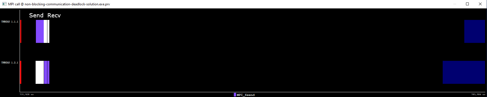
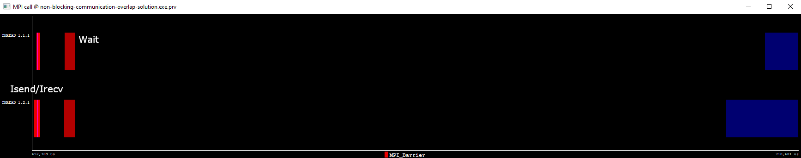

Non-blocking collective communication
=====================================

.. questions::

   - Is the synchronization of collective communications avoidable?

.. objectives::

   - Understand that a non-blocking barrier is useful

Introduction
------------

Just like for point-to-point messages, applications that use
non-blocking collectives can be more efficient than blocking
ones. This is because the latency of communication can overlap with
unrelated computation.

Non-blocking barrier synchronization
------------------------------------

At first glance, this seems like a nonsense. However if a barrier is
needed, then it can be quite useful to overlap work with the
synchronization. Use cases are rare, but include highly unstructured
work described by variable numbers of messages sent between ranks, or
very latency-sensitive applications.

.. signature:: |term-MPI_Ibarrier|

   .. code-block:: c

      int MPI_Ibarrier(MPI_Comm comm,
                       MPI_Request *request)

.. parameters::

   A communicator ``comm`` and a ``request`` object that is a handler
   for a later wait call.

It is necessary to use blocking barrier only when communicating
through a side channel, like a file or a socket.

Non-blocking reduce
-------------------

|term-MPI_Ireduce| starts a reduction operation and generates a request in
an ``MPI_Request`` object. The reduction process is completed only when a test
is passed or a wait call is done. Upon completion, the reduced value is collected
in the root process.

.. signature:: |term-MPI_Ireduce|

   .. code-block:: c

      int MPI_Ireduce(const void* sendbuf,
                      void* recvbuf,
                      int count,
                      MPI_Datatype datatype,
                      MPI_Op op,
                      int root,
                      MPI_Comm comm,
                      MPI_Request *request)

.. parameters::

   ``sendbuf``, ``recvbuf``, and ``count`` are the buffer on **each**
   process, the buffer on ``root``, and the number of elements to be
   on each process. ``datatype`` is the type of the data to be reduced. 
   ``op`` is the reduction operation to be applied on the distributed
   data. The global result of the reduction operation is collected in
   the ``root`` process in the communicator ``comm``. The
   ``request`` object that is returned must be used to wait on the
   communication later.

Code-along exercise: non-blocking ireduce during stencil workflow
-----------------------------------------------------------------

.. challenge:: Observe a running total during a stencil workflow

   You can find a scaffold for the code in the ``content/code/day-3/00_ireduce``
   folder. It is quite similar to that for the earlier non-blocking code-along
   exercise. A working solution is in the ``solution`` subfolder. Try to compile
   with::

        mpicc -g -Wall -std=c11 non-blocking-communication-ireduce.c -o non-blocking-communication-ireduce

   #. When you have the code compiling, try to run with::

        mpiexec -np 2 ./non-blocking-communication-ireduce

   #. Try to fix the code TODO

.. solution::

   * One correct approach is::

        TODO

   * There are other approaches that work correctly. Is yours better
     or worse than this one? Why?

Code analysis
-------------

How can you know when a blocking or non-blocking communication is required?
It is cumbersome to analyse code with printing out instructions (``printf``)
embedded in the code. For this reason, analysis tools have been written that
allow you to monitor the behavior of your code in more detail.
Some of these tools are Extrae/Paraver, TAU, Scalasca, to cite only a few of them.

Here, we will mention the combination of Extrae and Paraver tools that are
developed at the Barcelona Supercomputing Center (BSC) and provide support
for different architectures including CPUs and GPUs and also for different
parallelisation levels, for instance, MPI, OpenMP, and MPI+OpenMP. Extrae is the
tool used for producing trace files while Paraver is the visualiser/analyser
tool.

In order to use Extrae, one needs to compile the code with debugging flag
(``-g``). Events that should be monitored by Extrae are included in a ``.xml``
file (``extrae.xml``), for instance MPI or OpenMP:

.. signature:: |``extrae.xml``|

   .. code-block:: c

      <?xml version='1.0'?>
      
        <trace enabled="yes"
         home="/software/Extrae/3.8.0-gompi-2020b"
         initial-mode="detail"
         type="paraver" >
      
        <mpi enabled="yes">
          <counters enabled="yes" />
        </mpi>
      
        <openmp enabled="no">
          <locks enabled="no" />
          <counters enabled="no" />
        </openmp>
      
      </trace>

For the non-blocking deadlock and overlap cases discussed in the previous lecture,
the MPI call events show the following patterns in Paraver:

   MPI calls analysis for the deadlock case in the previous non-blocking
   section.

   MPI calls analysis for the overlap case.

Notice that the size in the horizontal axis for the grid was increased to 8000
to make the visualisation clearer. From the overlap case, we can see that some
work was interleaved (black region) between the |term-MPI_Isend| and 
|term-MPI_Irecv| calls and the waiting call (red rectangles).

See also
--------

* Chapter 2 of the **Using Advanced MPI** book by William Gropp *et al.* show
  examples of using the functions described in this episode. :cite:`Gropp2014-dz`
* https://www.codingame.com/playgrounds/349/introduction-to-mpi/non-blocking-communications
* https://tools.bsc.es/
* https://www.cs.uoregon.edu/research/tau/home.php
* https://www.scalasca.org/
* https://prace-ri.eu/wp-content/uploads/WP237.pdf

.. keypoints::

   - Non-blocking collectives take advantage of the efficiency of collective
     communications and allow at the same time the possibility of interleaving
     useful work.
   - Although it sounds contradictory and unuseful, a non-blocking barrier is
     sometimes handy, for instance in the case where only a notification from
     the processses arriving to the barrier is needed.
   - There are several available tools that can allow you to analyse your code in
     detail. Here, we have described the Extrae and Paraver tools but there are
     others in the market.
