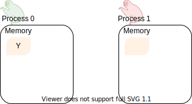
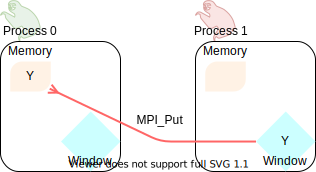

.. _one-sided-concepts:

One-sided communication: concepts
=================================

.. questions::

   - How can we optimize communication?

.. objectives::

   - Learn about concepts in MPI for remote-memory access (RMA)

You are already familiar with the |term-MPI_Send|/|term-MPI_Recv| communication
pattern in MPI. This pattern is also called **two-sided communication**: the two
processes implicitly *synchronize* with each other.
It is like calling up someone: you wait for the other person to pick up to actually deliver your message.

.. figure:: img/E02-send-recv_step2.svg
   :align: center

   Two-sided communication between two sloths. Both of them are **active**
   participants in the communication: the |term-MPI_Send| has to be matched by
   an |term-MPI_Recv|. In this model, we can experience deadlocks and/or
   degraded computational performance.

However, this is not always the most optimal pattern for transferring data. MPI
offers routines to perform *remote memory access* (:term:`RMA`), also known as
*one-sided communication*, where processes can access data on other processes,
as long as it is made available in special *memory windows*.

Proceeding with our telecommunications analogy: one-sided communication
resembles an email. Your message will sit in your friend's inbox, but you are
immediately free to do other things after hitting the send button! Your friend
will read the email at their leisure.

At a glance: how does it work?
------------------------------

Let us look at the following figure, what routines are available in MPI for
process 0 communicate a variable in its local memory to process 1?

   Steve, the sloth on the left, would like to send Alice, the sloth on the
   right, the data in its ``Y`` variable. This data is stored in Steve's local
   memory, depicted as a yellow box.

It is foundational to MPI that every interaction between processes be
*explicit*, so a simple assignment will not do.
First, we must make a portion of memory on the *target process*, process 1
in this case, visible for process 0 to manipulate.
We call this a **window** and we will represent it as a blue diamond.

.. figure:: img/E02-steve-alice_step1.svg
   :align: center

   We call collective routines, provided by MPI, to open a **memory window** on
   each process in the communicator. Both the target and origin processes will
   expose a portion of their memory through their respective windows.

Once a *window* into the memory of process 1 is open, process 0 can access it and manipulate
it. Process 0 can **put** (store) data in its local memory into the memory window of process
1, using |term-MPI_Put|:

   The **origin process** (left sloth) puts data in the memory window of the
   **target process** (right sloth).
   The |term-MPI_Put| routine is represented with a red line whose arrowhead touches the
   origin process of the call.

In this example, process 0 is the origin process: it participates actively in
the communication by calling the :term:`RMA` routine |term-MPI_Put|.  Process 1
in the target process.

Conversely, process 0 might have populated its memory window with some data: any
other process in the communicator can now **get** (load) this data, using |term-MPI_Get|:

.. figure:: img/E02-steve-alice_step3.svg
   :align: center

   The **origin process** (right sloth) gets data in the memory window of the
   **target process** (left sloth).
   The |term-MPI_Get| routine is represented with a blue line whose arrowhead touches the
   origin process.

In this scenario, process 1 is the origin process: it participates actively in the
communication by calling the :term:`RMA` routine |term-MPI_Get|.  Process 0 is
the target process.

.. note::

   - With the term *memory window* or simply *window* we refer to the memory,
     local to each process, reserved for remote memory accesses. A *window
     object* is instead the collection of windows of all processes in the
     communicator and it has type ``MPI_Win``.

.. callout:: Graphical conventions

   We have introduced these graphical conventions:

   - A memory window is a blue diamond.
   - A call to |term-MPI_Get| is a :blue:`blue` line whose arrowhead touches the origin
     process.
   - A call to |term-MPI_Put| is a :red:`red` line whose arrowhead touches the origin
     process.
   - For both routines, the direction of the arrowhead shows from which memory
     window the data moves.

.. challenge:: What kind of operations are being carried out?

   #. .. figure:: img/E02-mpi_put.svg

      A. Process 1 calls |term-MPI_Put| with process 0 as target.
      B. Process 1 calls |term-MPI_Send| with process 0 as receiver.
      C. Process 0 calls |term-MPI_Get| with process 1 as target.
      D. Process 1 calls |term-MPI_Get| with  process 0 as target.

   #. .. figure:: img/E02-mpi_send_mpi_recv.svg

      A. Process 0 calls |term-MPI_Send| with process 1 as receiver. Process 1 matches the call with |term-MPI_Get|.
      B. Process 0 calls |term-MPI_Put|. Process 1 retrieves the data with |term-MPI_Recv|.
      C. Process 0 calls |term-MPI_Send| matched with a call to |term-MPI_Recv| by process 1.
      D. None of the above.

   #. .. figure:: img/E02-mpi_get.svg

      A. Process 1 calls |term-MPI_Put| with process 0 as target.
      B. Process 1 calls |term-MPI_Recv| with process 0 as sender.
      C. Process 0 calls |term-MPI_Get| with process 1 as target.
      D. Process 1 calls |term-MPI_Get| with  process 0 as target.

   #. .. figure:: img/E02-local_load_store.svg

      A. Process 1 calls |term-MPI_Put| with process 0 as target.
      B. Process 0 loads a variable from its window to its local memory.
      C. Process 0 calls |term-MPI_Get| with process 1 as target.
      D. Process 0 stores a variable from its local memory to its window.

   #. .. figure:: img/E02-win_mpi_send_mpi_recv.svg

      A. Process 0 calls |term-MPI_Send| with process 1 as receiver. Process 1 matches the call with |term-MPI_Get|.
      B. Process 1 calls |term-MPI_Get| with process 0 as target.
      C. None of the options.
      D. Process 0 calls |term-MPI_Send| matched with a call to |term-MPI_Recv| by process 1.

   #. .. figure:: img/E02-invalid.svg

      A. Process 0 calls |term-MPI_Send| matched with a call to |term-MPI_Recv| by process 1.
      B. This operation is not valid in MPI.
      C. Process 1 calls |term-MPI_Get| with process 0 as target.
      D. Process 0 calls |term-MPI_Put| with process 1 as target.

.. solution::

   #. **A** is the correct answer. Process 1 initiates the one-sided memory access,
      in order to *put* (*store*) the contents of its local memory to the remote memory
      window opened on process 0.
   #. **C** is the correct answer. This is the standard, blocking two-sided
      communication pattern in MPI.
   #. **D** is the correct answer. Process 1 initiates the one-sided memory
      access in order to *get* (*load*) the contents of the remote memory window on
      process 0 to its local memory.
   #. Both **B** and **D** are valid answers. The figure depicts a memory
      operation *within* process 0, which does not involve communication with
      any other process and thus pertains the programming language and not MPI.
   #. **D** is the correct answer. This is the standard, blocking two-sided
      communication pattern in MPI: it does not matter whether the message stems
      from memory local to process 0 or its remotely accessible window.
   #. **B** is the correct answer. Different processes can only interact with
      explicit two-sided communication or by first publishing to their remotely
      accessible window.

It is rarely the case that things are as simple as in a figure.  With great
power, come great responsibilities: operations on windows are non-blocking.
Whereas non-blocking operations allow the programmer to overlap computation and
communication, they also pose the burden of **explicit synchronization**.
One-sided communication has its own styles of synchronization, which we will cover in the episode :ref:`one-sided-sync`. The following figure shows,
schematically, the concept of *epochs* in RMA and the life cycle of a window
object.

.. figure:: img/E02-RMA_timeline-coarse.svg
   :align: center

   The timeline of window creation, calls to RMA routines, and synchronization
   in an application which uses MPI one-sided communication.
   The creation of ``MPI_Win`` objects in each process in the communicator
   allows the execution of RMA routines. Each access to the window must be
   synchronized: to ensure safety and correctness of the application.
   Note that **any** interaction with the memory window **must** be protected by
   calls to synchronization routines: even local load/store and/or two-sided
   communication.
   The events in between synchronization calls are said to happen in **epochs**.

See also
--------

* The lecture covering MPI RMA from EPCC is available
  `here <http://www.archer.ac.uk/training/course-material/2020/01/advMPI-imperial/Slides/L07-Intro%20to%20RMA.pdf>`_
* Chapter 3 of the **Using Advanced MPI** by William Gropp *et al.* :cite:`Gropp2014-dz`

.. keypoints::

   - The MPI model for remote memory accesses.
   - Window objects and memory windows.
   - Timeline of RMA and the importance of synchronization.
