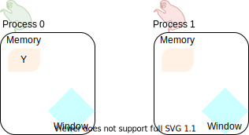

.. _one-sided-1:

One-sided communication: basic concepts
=======================================

.. questions::

   - How can we optimize communication?

.. objectives::

   - Learn about functions for remote-memory access (RMA)
   - RMA: |term-MPI_Get|, |term-MPI_Put|, |term-MPI_Accumulate|
   - Windows: |term-MPI_Win_create|, |term-MPI_Win_allocate|, |term-MPI_Win_allocate_shared|, |term-MPI_Win_create_dynamic|

You are already familiar with the |term-MPI_Send|/|term-MPI_Recv| communication
pattern in MPI. This pattern is also called **two-sided communication**: the two
processes implicitly *synchronize* with each other.
It is like calling up someone: you wait for the other person to pick up to actually deliver your message.

.. figure:: img/send-recv_step2.svg
   :align: center

   Two-sided communication between two sloths. Both of them are **active**
   participants in the communication: the |term-MPI_Send| has to be matched by
   an |term-MPI_Recv|.

However, this is not always the most optimal pattern for transferring data. MPI
offers routines to perform *remote memory access* (:term:`RMA`), also known as
*one-sided communication*, where processes can access data on other processes,
as long as it is made available in special *memory windows*.

Proceeding with our telecommunications analogy: one-sided communication
resembles an email. Your message will sit in your friend's inbox, but you are
immediately free to do other things after hitting the send button!

.. discussion::

   - What could be problematic with one-sided communication?
   - What would be the advantages of using one-sided communication?
   - What would be the disadvantages?

At a glance: how does it work?
------------------------------

Let us look at the following figure, what routines are available in MPI for
process 0 communicate a variable in its local memory to process 1?

.. figure:: img/steve-alice_step0.svg
   :align: center

   Steve, the sloth on the left, would like to send Alice, the sloth on the
   right, the data in its ``Y`` variable. This data is stored in Steve's local
   memory, depicted as a yellow box.

It is foundational to MPI that every interaction between processes be
*explicit*, so a simple assignment will not do.
First, we must make a portion of memory on the *target process*, process 1
in this case, visible for process 0 to manipulate.
We call this a **window** and we will represent it as a blue diamond.

   We call collective routines, provided by MPI, to open a **memory window** on
   each process in the communicator. Both the target and origin processes will
   expose a portion of their memory through their respective windows.

Once a *window* into the memory of process 1 is open, process 0 can access it and manipulate
it. Process 0 can **put** (store) data in its local memory into the memory window of process
1, using |term-MPI_Put|:

.. figure:: img/steve-alice_step2.svg
   :align: center

   The **origin process** (left sloth) puts data in the memory window of the
   **target process** (right sloth).
   The |term-MPI_Put| routine is represented with a red line whose arrowhead touches the
   origin process of the call.

In this example, process 0 is the origin process: it participates actively in
the communication by calling the :term:`RMA` routine |term-MPI_Put|.  Process 1
in the target process.

Conversely, process 0 might have populated its memory window with some data: any
other process in the communicator can now **get** (load) this data, using |term-MPI_Get|:

.. figure:: img/steve-alice_step3.svg
   :align: center

   The **origin process** (right sloth) gets data in the memory window of the
   **target process** (left sloth).
   The |term-MPI_Get| routine is represented with a blue line whose arrowhead touches the
   origin process.

In this scenario, process 1 is the origin process: it participates actively in the
communication by calling the :term:`RMA` routine |term-MPI_Get|.  Process 0 is
the target process.

.. callout:: Graphical conventions

   We have introduced these graphical conventions:

   - A memory window is a blue diamond.
   - A call to |term-MPI_Get| is a :blue:`blue` line whose arrowhead touches the origin
     process.
   - A call to |term-MPI_Put| is a :red:`red` line whose arrowhead touches the origin
     process.
   - For both routines, the direction of the arrowhead shows from which memory
     window the data moves.

.. challenge:: What kind of operations are being carried out?

   #. .. figure:: img/E02-mpi_put.svg

      A. Process 1 calls |term-MPI_Put| with process 0 as target.
      B. Process 1 calls |term-MPI_Send| with process 0 as receiver.
      C. Process 0 calls |term-MPI_Get| with process 1 as target.
      D. Process 1 calls |term-MPI_Get| with  process 0 as target.

   #. .. figure:: img/E02-mpi_send_mpi_recv.svg

      A. Process 0 calls |term-MPI_Send| with process 1 as receiver. Process 1 matches the call with |term-MPI_Get|.
      B. Process 0 calls |term-MPI_Put|. Process 1 retrieves the data with |term-MPI_Recv|.
      C. Process 0 calls |term-MPI_Send| matched with a call to |term-MPI_Recv| by process 1.
      D. None of the above.

   #. .. figure:: img/E02-mpi_get.svg

      A. Process 1 calls |term-MPI_Put| with process 0 as target.
      B. Process 1 calls |term-MPI_Recv| with process 0 as sender.
      C. Process 0 calls |term-MPI_Get| with process 1 as target.
      D. Process 1 calls |term-MPI_Get| with  process 0 as target.

   #. .. figure:: img/E02-local_load_store.svg

      A. Process 1 calls |term-MPI_Put| with process 0 as target.
      B. Process 0 loads a variable from its window to its local memory.
      C. Process 0 calls |term-MPI_Get| with process 1 as target.
      D. Process 0 stores a variable from its local memory to its window.

   #. .. figure:: img/E02-win_mpi_send_mpi_recv.svg

      A. Process 0 calls |term-MPI_Send| with process 1 as receiver. Process 1 matches the call with |term-MPI_Get|.
      B. Process 1 calls |term-MPI_Get| with process 0 as target.
      C. None of the options.
      D. Process 0 calls |term-MPI_Send| matched with a call to |term-MPI_Recv| by process 1.

   #. .. figure:: img/E02-invalid.svg

      A. Process 0 calls |term-MPI_Send| matched with a call to |term-MPI_Recv| by process 1.
      B. This operation is not valid in MPI.
      C. Process 1 calls |term-MPI_Get| with process 0 as target.
      D. Process 0 calls |term-MPI_Put| with process 1 as target.

.. solution::

   #. **A** is the correct answer. Process 1 initiates the one-sided memory access,
      in order to *put* (*store*) the contents of its local memory to the remote memory
      window opened on process 0.
   #. **C** is the correct answer. This is the standard, blocking two-sided
      communication pattern in MPI.
   #. **D** is the correct answer. Process 1 initiates the one-sided memory
      access in order to *get* (*load*) the contents of the remote memory window on
      process 0 to its local memory.
   #. Both **B** and **D** are valid answers. The figure depicts a memory
      operation *within* process 0, which does not involve communication with
      any other process and thus pertains the programming language and not MPI.
   #. **D** is the correct answer. This is the standard, blocking two-sided
      communication pattern in MPI: it does not matter whether the message stems
      from memory local to process 0 or its remotely accessible window.
   #. **B** is the correct answer. Different processes can only interact with
      explicit two-sided communication or by first publishing to their remotely
      accessible window.

RMA anatomy
-----------

One-sided communication in MPI is achieved in three steps, which map onto three sets of functions:

Windows
  Make memory available on each process for remote memory accesses. We use
  *memory windows*, which are objects of type ``MPI_Win`` providing handles to
  remotely-accessible memory.  MPI provides 4 **collective** routines for the
  creation of memory windows:

  - |term-MPI_Win_allocate| allocates memory and creates the window object.
  - |term-MPI_Win_create| creates a window from already allocated memory.
  - |term-MPI_Win_allocate_shared| creates a window from already allocated MPI shared memory.
  - |term-MPI_Win_create_dynamic| creates a window from allocated memory, but
    the window-memory pairing is deferred.

  A handle of type ``MPI_Win`` manages memory made available for remote
  operations on *all ranks* in the communicator.
  Memory windows must be explicitly freed after use with |term-MPI_Win_free|.

Load/store

  Load/store/transform data in remote windows. We can identify an *origin* and a
  *target* process. At variance with two-sided communication, the origin process
  fully specifies the data transfer: where the data comes from and where it is
  going to. There are three main groups of MPI routines for this purpose:

  - **Put** |term-MPI_Put| and ``MPI_Rput``
  - **Get** |term-MPI_Get| and ``MPI_Rget``
  - **Accumulate** |term-MPI_Accumulate|, ``MPI_Raccumulate`` and variations thereof.

Synchronization
  Ensure that the data is available for remote memory accesses. The load/store
  routines are *nonblocking* and the programmer must take care that subsequent
  accesses are *safe* and *sound*.  Synchronization can be achieved in two
  styles:

  - **Active** if both origin and target processes play a role.
  - **Passive** if the origin process orchestrates data transfer and synchronization.

  There are three sets of routines currently available in MPI:

  - |term-MPI_Win_fence| this is an example of **active target** synchronization.
  - |term-MPI_Win_start|, |term-MPI_Win_complete|, |term-MPI_Win_post|, |term-MPI_Win_wait| another example of **active target** synchronization.
  - |term-MPI_Win_lock|, |term-MPI_Win_unlock| which enables **passive target** synchronization.

  We will discuss synchronization further in the next episode :ref:`one-sided-2`.

.. figure:: img/RMA_timeline-coarse.svg
   :align: center

   The timeline of window creation, calls to RMA routines, and synchronization
   in an application which uses MPI one-sided communication.
   The creation of ``MPI_Win`` objects in each process in the communicator
   allows the execution of RMA routines. Each access to the window must be
   synchronized: to ensure safety and correctness of the application.
   Note that **any** interaction with the memory window **must** be protected by
   calls to synchronization routines: even local load/store and/or two-sided
   communication.
   The events in between synchronization calls are said to happen in *epochs*.

.. instructor-note:: Type-along

   Type along showing two processes talking with RMA.

.. discussion::

   - How could this be achieved with two-sided communication? We will revisit
     this example when talking about non-blocking communication.

Window creation
---------------

The creation of ``MPI_Win`` objects is a collective operation: each process in
the communicator will reserve the specified memory for remote memory accesses.

.. signature:: |term-MPI_Win_allocate|

   Use this function to *allocate* memory and *create* a window object out of it.

   .. code-block:: c

      int MPI_Win_allocate(MPI_Aint size,
                           int disp_unit,
                           MPI_Info info,
                           MPI_Comm comm,
                           void *baseptr,
                           MPI_Win *win)

  We can expose an array of 10 ``double``-s for RMA with:

  .. literalinclude:: code/snippets/allocate.c
     :language: c
     :lines: 6-15
     :dedent: 2

.. parameters::

   ``size``
       Size in bytes.
   ``disp_unit``
       Displacement units. If ``disp_unit = 1``, then displacements are computed
       in bytes. The use of displacement units can help with code readability
       and is essential for correctness on heterogeneous systems, where the
       sizes of the basis types might differ between processes.  See also
       :ref:`derived-datatypes`.
   ``info``
       An info object, which can be used to provide optimization hints to the
       MPI implementation. Using ``MPI_INFO_NULL`` is always correct.
   ``comm``
       The (intra)communicator.
   ``baseptr``
       The base pointer.
   ``win``
       The window object.

.. signature:: |term-MPI_Win_create|

   With this routine you can tell MPI what memory to expose as
   window. The memory must be already allocated and contiguous, since it will be
   specified in input as **base address plus size in bytes**.

   .. code-block:: c

      int MPI_Win_create(void *base,
                         MPI_Aint size,
                         int disp_unit,
                         MPI_Info info,
                         MPI_Comm comm,
                         MPI_Win *win)

   What if the memory is not allocated? We advise to use |term-MPI_Alloc_mem|:

   .. literalinclude:: code/snippets/alloc_mem+win_create.c
      :language: c
      :lines: 6-21
      :dedent: 2

   You must explicitly call |term-MPI_Free_mem| to deallocate memory obtained
   with |term-MPI_Alloc_mem|.

.. parameters::

   ``base``
       The base pointer.
   ``size``
       Size in bytes.
   ``disp_unit``
       Displacement units. If ``disp_unit = 1``, then displacements are computed
       in bytes. The use of displacement units can help with code readability
       and is essential for correctness on heterogeneous systems, where the
       sizes of the basis types might differ between processes.  See also
       :ref:`derived-datatypes`.
   ``info``
       An info object, which can be used to provide optimization hints to the
       MPI implementation. Using ``MPI_INFO_NULL`` is always correct.
   ``comm``
       The (intra)communicator.
   ``win``
       The window object.

.. note::

   - With the term *memory window* or simply *window* we refer to the memory,
     local to each process, reserved for remote memory accesses. A *window
     object* is instead the collection of windows of all processes in the
     communicator and it has type ``MPI_Win``.
   - The memory window is usually a single array: the size of the window object
     then coincides with the size of the array.  If the base type of the array
     is a simple type, then the displacement unit is the size of that type,
     *e.g.* ``double`` and ``sizeof(double)``.  You should use a displacement
     unit of 1 otherwise.

RMA operations
--------------

.. signature:: |term-MPI_Put|

   Store data from the **origin** process to the memory window of the **target**
   process.
   The origin process is the *source*, while the target process is the
   *destination*.

   .. code-block:: c

      int MPI_Put(const void *origin_addr,
                  int origin_count,
                  MPI_Datatype origin_datatype,
                  int target_rank,
                  MPI_Aint target_disp,
                  int target_count,
                  MPI_Datatype target_datatype,
                  MPI_Win win)

.. signature:: |term-MPI_Get|

   Load data from the memory window of the **target** process to the **origin**
   process.
   The origin process is the *destination*, while the target process is the
   *source*.

   .. code-block:: c

      int MPI_Get(void *origin_addr,
                  int origin_count,
                  MPI_Datatype origin_datatype,
                  int target_rank,
                  MPI_Aint target_disp,
                  int target_count,
                  MPI_Datatype target_datatype,
                  MPI_Win win)

.. parameters::

   Both |term-MPI_Put| and |term-MPI_Get| are *nonblocking*: they are completed
   by a call to synchronization routines.
   The two functions have the same argument list. Similarly to |term-MPI_Send|
   and |term-MPI_Recv|, the data is specified by the triplet of address, count,
   and datatype.
   For the data at the *origin* process this is: ``origin_addr``,
   ``origin_count``, ``origin_datatype``.
   On the *target* process, we describe the buffer in terms of displacement,
   count, and datatype: ``target_disp``, ``target_count``, ``target_datatype``.
   The address of the buffer on the target process is computed using the base
   address and displacement unit of the ``MPI_Win`` object:

   .. code-block:: c

      target_addr = win_base_addr + target_disp * disp_unit

   With |term-MPI_Put|, the ``origin`` triplet specifies the **local send
   buffer**; while with |term-MPI_Get| it specifies the **local receive
   buffer**.
   The ``target_rank`` parameter is, as the name suggests, the rank of the
   target process in the communicator.

.. signature:: |term-MPI_Accumulate|

   Store data from the **origin** process to the memory window of the **target**
   process *and* combine it using one the predefined MPI reduction operations.

   .. code-block:: c

      int MPI_Accumulate(const void *origin_addr,
                         int origin_count,
                         MPI_Datatype origin_datatype,
                         int target_rank,
                         MPI_Aint target_disp,
                         int target_count,
                         MPI_Datatype target_datatype,
                         MPI_Op op,
                         MPI_Win win)

   The argument list to |term-MPI_Accumulate| is the same as for |term-MPI_Put|,
   with the addition of the ``op`` parameter with type ``MPI_Op``, which
   specifies which reduction operation to execute on the target process.
   This routine is **elementwise atomic**: accesses from multiple processes will
   be serialized in some order and no race conditions can thus occur.  You still
   need to exercise care though: reductions are only deterministic if the
   operation is *associative* and *commutative* for the given datatype.  For
   example, ``MPI_SUM`` and ``MPI_PROD`` are *neither* associative *nor*
   commutative for floating point numbers!

Other routines for RMA operations are:

Request-based variants
   These routines return a handle of type ``MPI_Request`` and synchronization
   can be achieved with ``MPI_Wait``.

     - ``MPI_Rget``
     - ``MPI_Rput``
     - ``MPI_Raccumulate``
     - ``MPI_Rget_accumulate``

Specialized accumulation variants
   These functions perform specialized accumulations, but are conceptually
   similar to |term-MPI_Accumulate|.

     - ``MPI_Get_accumulate``
     - ``MPI_Fetch_and_op``
     - ``MPI_Compare_and_swap``

.. challenge:: Describe the operations depicted.

   #. question

      A. Option
      B. Option
      C. Option
      D. Option

.. solution::

   #. solution

See also
--------

* The lecture covering MPI RMA from EPCC is available
  `here <http://www.archer.ac.uk/training/course-material/2020/01/advMPI-imperial/Slides/L07-Intro%20to%20RMA.pdf>`_
* Chapter 3 of the **Using Advanced MPI** by William Gropp *et al.* :cite:`Gropp2014-dz`

.. keypoints::

   - The MPI model for remote memory accesses.
   - The basic routines to publish remotely accessible memory.
   - The basic routines to modify remote memory windows.
