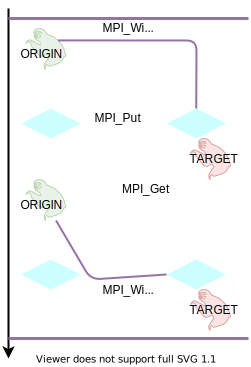
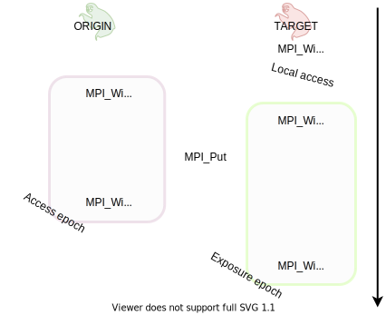

.. _one-sided-2:

One-sided communication: synchronization
========================================

.. questions::

   - What are the pitfalls of RMA?
   - How can we make RMA safe and correct?

.. objectives::

   - Active synchronization: |term-MPI_Win_fence|, |term-MPI_Win_post|, |term-MPI_Win_start|, |term-MPI_Win_complete|, |term-MPI_Win_wait|
   - Passive synchronization: |term-MPI_Win_lock|, |term-MPI_win_unlock|

.. challenge:: What could go wrong?

   .. figure:: img/E03-race_MPI_Put.svg
      :align: center

      Steve and Alice are joined by Martha. It is not really clear which value
      Alice will find in the memory window!

Epochs
------

In the last episode, we introduced the concept of *epochs* in one-sided
communication.  Recall that an **epoch** is the execution span occurring between
calls to MPI synchronization functions.
Calls to |term-MPI_Put|, |term-MPI_Get|, and |term-MPI_Accumulate| must be
encapsulated within an **access epoch** for the memory window.
Multiple data transfers can occur within the same epoch, amortizing the
performance downsides of synchronization operations.

.. figure:: img/E02-RMA_timeline-coarse.svg
   :align: center

   The timeline of window creation, calls to RMA routines, and synchronization
   in an application which uses MPI one-sided communication.
   The creation of ``MPI_Win`` objects in each process in the communicator
   allows the execution of RMA routines. Each access to the window must be
   synchronized: to ensure safety and correctness of the application.
   Note that **any** interaction with the memory window **must** be protected by
   calls to synchronization routines: even local load/store and/or two-sided
   communication.
   The events in between synchronization calls are said to happen in *epochs*,
   here represented by vertical purple lines.

Some general rules:

- *Any* call to RMA communication functions that take a ``MPI_Win`` object as
  argument, *must* occur within an access epoch.
- Memory windows at a given process can be featured in multiple epochs, as long
  as the epochs *do not* overlap. Conversely, epochs on distinct memory windows
  can overlap.
- Local and non-RMA MPI operations are safe within an epoch.

Active target communication
---------------------------

In active target communication, the synchronization happens both on the origin
and the target process.

   The origin process issues both synchronization and data movement calls. The
   target also issues synchronization calls, hence the name active target
   communication.  Synchronization on the target process starts the **exposure
   epoch** of its memory window.  Synchronization on the origin process starts
   the **access epoch** on the target's memory window.  Once the origin process
   has completed its RMA operations, the programmer must take care to
   synchronize once more on the origin to  close the access epoch. The exposure
   epoch is closed by yet another synchronization call on the target process.

The structure of an epoch assumes more fine-grained detail:

- An **exposure epoch** is enclosed within synchronization calls by the target
  process. The target process makes known to potential origin processes the
  availability of its memory window.
- An **access epoch** is enclosed within synchronization calls by the origin
  process. There can be *multiple* access epochs within the same exposure epoch.

Exposure and access epochs can be interleaved and overlapped, with few *caveats*:

- A process' memory window can be in multiple exposure epochs, as long as these
  are disjoint.
- An exposure epoch for a process' memory window may overlap with exposure
  epochs on other windows.
- An exposure epoch for a process' memory window may overlap with access epochs
  for the same or other ``MPI_Win`` window objects.

Fence
^^^^^

Using a fence is possibly the easiest way to realize the active target
communication paradigm. These synchronization calls are collective within the
communicator underlying the window object.

   The origin process issues both synchronization and data movement calls. The
   target also issues synchronization calls, hence the name active target
   communication.  Synchronization on origin and target starts the *access
   epoch* on the target's memory windows. Once the origin process has completed
   its RMA operations, the programmer must take care to synchronize once more,
   thus closing the access epoch.

RMA communication calls are surrounded by |term-MPI_Win_fence| calls.  This
collective operation opens *and* closes an access epoch at an origin process
and an exposure epoch at a target process. There is thus a one-to-one
correspondence between the duration of access and exposure epochs.

Calls to |term-MPI_Win_fence| act similarly to barriers: the MPI implementation
will synchronize the sequence of RMA calls occurring between two fences.

.. signature:: |term-MPI_Win_fence|

   Use this function to *allocate* memory and *create* a window object out of it.

   .. code-block:: c

      int MPI_Win_fence(int assert,
                        MPI_Win win)

.. parameters::

   ``assert``
       Use this argument to provide optimization *hints* to the MPI library.
       Setting this argument to ``0`` is always correct.
   ``win``
       The window object.

Post/Start/Complete/Wait
^^^^^^^^^^^^^^^^^^^^^^^^

The use of |term-MPI_Win_fence| can pose constraints on RMA communication and,
since it's a collective operation, incur performance penalties.  Imagine, for
example, that you created a window object in a communicator with ``N``
processes, but that only pairs of processes do RMA operations. Fencing these
operations will force the *whole* communicator to synchronize, even though in
reality only the interacting pairs should do so.

MPI enables you to have more fine-grained control than fences over synchronization.

Exposure epochs on target processes can be opened and closed with:

- |term-MPI_Win_post|,
- |term-MPI_Win_wait| or |term-MPI_Win_test|,

while opening and closing of access epochs on origin processes is enabled by:

- |term-MPI_Win_start|,
- |term-MPI_Win_complete|.

   Any process can issue a call to |term-MPI_Win_post| to initiate an exposure
   epoch for a specific group of processes.  For this group of processes, the
   access epoch starts with a call to |term-MPI_Win_start| and end with a call
   to |term-MPI_Win_complete|.

   You should note that the programmer has to explicitly manage the pairing of
   exposure and access epochs in this model: all communications partners should be
   known.

.. signature:: |term-MPI_Win_post|

   Use this function to *allocate* memory and *create* a window object out of it.

   .. code-block:: c

      int MPI_Win_post(MPI_Group group,
                       int assert,
                       MPI_Win win)

  We can expose an array of 10 ``double``-s for RMA with:

.. parameters::

   ``assert``
       Size in bytes.
   ``win``
       The window object.

.. signature:: |term-MPI_Win_start|

   .. code-block:: c

      int MPI_Win_start(MPI_Group group,
                        int assert,
                        MPI_Win win)

.. signature:: |term-MPI_Win_complete|

   .. code-block:: c

      int MPI_Win_complete(MPI_Win win)

.. signature:: |term-MPI_Win_wait|

   .. code-block:: c

      int MPI_Win_wait(MPI_Win win)

.. signature:: |term-MPI_Win_test|

   .. code-block:: c

      int MPI_Win_test(MPI_Win win,
                       int *flag)

Passive target communication
----------------------------

In passive target communication, data momevement and synchronization are both
orchestrated by the origin process alone. This communication paradigm is
conceptually close to the shared memory model: the memory managed by the window
object is globally accessible to all process in the communicator.  Passive
target communication is achieved through |term-MPI_Win_lock| and
|term-MPI_Win_unlock|, which delimit the access epochs.
There are no exposure epochs in passive target communication.

.. figure:: img/E03-passive_target_communication.svg
   :align: center

.. signature:: |term-MPI_Win_lock|

   .. code-block:: c

      int MPI_Win_lock(int lock_type,
                       int rank,
                       int assert,
                       MPI_Win win)

.. signature:: |term-MPI_Win_unlock|

   .. code-block:: c

      int MPI_Win_unlock(int rank,
                         MPI_Win win)

.. challenge:: How could synchronization be performed?

   #. .. figure:: img/sync_quiz_q1.svg

      A. Wrong
      B. Wrong
      C. Wrong
      D. |term-MPI_Win_allocate|, |term-MPI_Win_fence|, |term-MPI_Put|, |term-MPI_Win_fence|, |term-MPI_Get|, |term-MPI_Win_fence|

   #. .. figure:: img/sync_quiz_q1.svg

      A. Wrong
      B. Wrong
      C. Wrong
      D. |term-MPI_Win_allocate|, |term-MPI_Win_fence|, |term-MPI_Put|, |term-MPI_Win_fence|, |term-MPI_Get|, |term-MPI_Win_fence|

.. solution::

   #. Option **A** is correct. Operations on a remote memory window must be
      encapsulated within an access epoch. In this case, we used the active
      target synchronization routine |term-MPI_Win_fence|.
   #.

See also
--------

* The lecture covering MPI RMA from EPCC is available
  `here <http://www.archer.ac.uk/training/course-material/2020/01/advMPI-imperial/Slides/L08-Advanced%20RMA.pdf>`_
* Chapters 3 and 4 of the **Using Advanced MPI** by William Gropp *et al.* :cite:`Gropp2014-dz`

.. keypoints::

   - RMA epochs and synchronization.
   - The difference between *active* and *passive* synchronization.
   - How and when to use different synchronization models.
