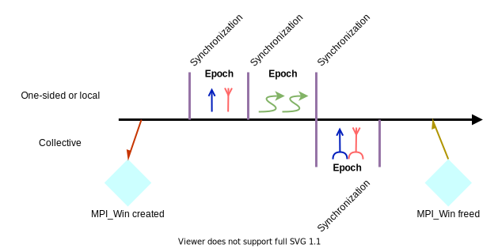
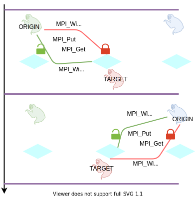

.. _one-sided-2:

One-sided communication: synchronization
========================================

.. questions::

   - What are the pitfalls of RMA?
   - How can we make RMA safe and correct?

.. objectives::

   - Active synchronization: |term-MPI_Win_fence|, |term-MPI_Win_post|, |term-MPI_Win_start|, |term-MPI_Win_complete|, |term-MPI_Win_wait|
   - Passive synchronization: |term-MPI_Win_lock|, |term-MPI_win_unlock|

.. figure:: img/E03-race_MPI_Put.svg
   :align: center

   Two-sided communication between two sloths. Both of them are **active**
   participants in the communication: the |term-MPI_Send| has to be matched by
   an |term-MPI_Recv|.

Epochs
------

   The timeline of window creation, calls to RMA routines, and synchronization
   in an application which uses MPI one-sided communication.
   The creation of ``MPI_Win`` objects in each process in the communicator
   allows the execution of RMA routines. Each access to the window must be
   synchronized: to ensure safety and correctness of the application.
   Note that **any** interaction with the memory window **must** be protected by
   calls to synchronization routines: even local load/store and/or two-sided
   communication.
   The events in between synchronization calls are said to happen in *epochs*.

Active target communication
---------------------------

.. signature:: |term-MPI_Win_fence|

   Use this function to *allocate* memory and *create* a window object out of it.

   .. code-block:: c

      int MPI_Win_fence(int assert,
                        MPI_Win win)

   We can expose an array of 10 ``double``-s for RMA with:

   .. literalinclude:: code/snippets/fence.c
      :language: c
      :lines: 6-15
      :dedent: 2

.. parameters::

   ``assert``
       Size in bytes.
   ``win``
       The window object.

.. signature:: |term-MPI_Win_post|

   Use this function to *allocate* memory and *create* a window object out of it.

   .. code-block:: c

      int MPI_Win_post(MPI_Group group,
                       int assert,
                       MPI_Win win)

  We can expose an array of 10 ``double``-s for RMA with:

.. parameters::

   ``assert``
       Size in bytes.
   ``win``
       The window object.

.. signature:: |term-MPI_Win_start|

   .. code-block:: c

      int MPI_Win_start(MPI_Group group,
                        int assert,
                        MPI_Win win)

.. signature:: |term-MPI_Win_complete|

   .. code-block:: c

      int MPI_Win_complete(MPI_Win win)

.. signature:: |term-MPI_Win_wait|

   .. code-block:: c

      int MPI_Win_wait(MPI_Win win)

Passive target communication
----------------------------

.. signature:: |term-MPI_Win_lock|

   .. code-block:: c

      int MPI_Win_lock(int lock_type,
                       int rank,
                       int assert,
                       MPI_Win win)

.. signature:: |term-MPI_Win_unlock|

   .. code-block:: c

      int MPI_Win_unlock(int rank,
                         MPI_Win win)

.. challenge:: How could synchronization be performed?

   #. .. figure:: img/sync_quiz_q1.svg

      A. Wrong
      B. Wrong
      C. Wrong
      D. |term-MPI_Win_allocate|, |term-MPI_Win_fence|, |term-MPI_Put|, |term-MPI_Win_fence|, |term-MPI_Get|, |term-MPI_Win_fence|

   #. .. figure:: img/sync_quiz_q1.svg

      A. Wrong
      B. Wrong
      C. Wrong
      D. |term-MPI_Win_allocate|, |term-MPI_Win_fence|, |term-MPI_Put|, |term-MPI_Win_fence|, |term-MPI_Get|, |term-MPI_Win_fence|

.. solution::

   #. Option **A** is correct. Operations on a remote memory window must be
      encapsulated within an access epoch. In this case, we used the active
      target synchronization routine |term-MPI_Win_fence|.
   #.

See also
--------

* The lecture covering MPI RMA from EPCC is available
  `here <http://www.archer.ac.uk/training/course-material/2020/01/advMPI-imperial/Slides/L08-Advanced%20RMA.pdf>`_
* Chapters 3 and 4 of the **Using Advanced MPI** by William Gropp *et al.* :cite:`Gropp2014-dz`

.. keypoints::

   - RMA epochs and synchronization.
   - The difference between *active* and *passive* synchronization.
   - How and when to use different synchronization models.
