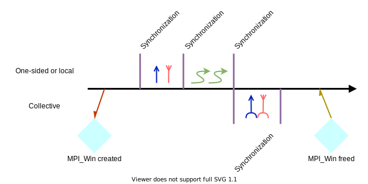
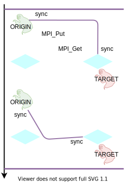
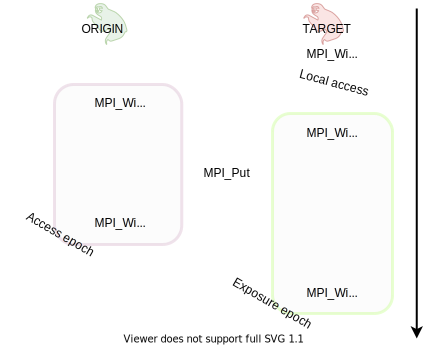
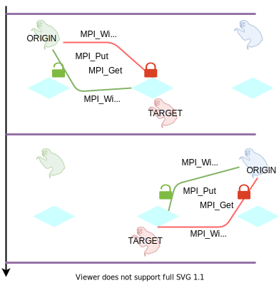

.. _one-sided-sync:

One-sided communication: synchronization
========================================

.. questions::

   - What are the pitfalls of RMA?
   - How can we make RMA safe and correct?

.. objectives::

   - Learn about active target communication and how to achieve it.
   - Learn about passive target communication and how to achieve it.

What could go wrong?
--------------------

.. figure:: img/E03-race_MPI_Put.svg
   :align: center

   Steve and Alice are joined by Martha. It is not really clear which value
   Alice will find in the memory window!

Epochs
------

In the last episode, we introduced the concept of *epochs* in one-sided
communication.  Recall that an **epoch** is the execution span occurring between
calls to MPI synchronization functions.
Calls to |term-MPI_Put|, |term-MPI_Get|, and |term-MPI_Accumulate| must be
encapsulated within an **access epoch** for the memory window.
Multiple data transfers can occur within the same epoch, amortizing the
performance downsides of synchronization operations.

   The timeline of window creation, calls to RMA routines, and synchronization
   in an application which uses MPI one-sided communication.
   The creation of ``MPI_Win`` objects in each process in the communicator
   allows the execution of RMA routines. Each access to the window must be
   synchronized to ensure safety and correctness of the application.
   Note that **any** interaction with the memory window **must** be protected by
   calls to synchronization routines: even local load/store and/or two-sided
   communication.
   The events in between synchronization calls are said to happen in **epochs**,
   here represented by vertical purple lines.

Some general rules:

- *Any* call to RMA communication functions that take a ``MPI_Win`` object as
  argument, *must* occur within an access epoch.
- Memory windows at a given process can be featured in multiple epochs, as long
  as the epochs *do not* overlap. Conversely, epochs on distinct memory windows
  can overlap.
- Local and non-RMA MPI operations are safe within an epoch.

Active target communication
---------------------------

In active target communication, the synchronization happens both on the origin
and the target process.

   The origin process issues both synchronization and data movement calls. The
   target also issues synchronization calls, hence the name active target
   communication.  Synchronization on the target process starts the **exposure
   epoch** of its memory window.  Synchronization on the origin process starts
   the **access epoch** on the target's memory window.  Once the origin process
   has completed its RMA operations, the programmer must take care to
   synchronize once more on the origin to  close the access epoch. The exposure
   epoch is closed by yet another synchronization call on the target process.

The structure of an epoch assumes more fine-grained detail:

- An **exposure epoch** is enclosed within synchronization calls by the target
  process. The target process makes known to potential origin processes the
  availability of its memory window.
- An **access epoch** is enclosed within synchronization calls by the origin
  process. There can be *multiple* access epochs within the same exposure epoch.

Exposure and access epochs can be interleaved and overlapped, with few *caveats*:

- A process' memory window can be in multiple exposure epochs, as long as these
  are disjoint.
- An exposure epoch for a process' memory window may overlap with exposure
  epochs on other windows.
- An exposure epoch for a process' memory window may overlap with access epochs
  for the same or other ``MPI_Win`` window objects.

Fence
^^^^^

Using a fence is possibly the easiest way to realize the active target
communication paradigm. These synchronization calls are collective within the
communicator underlying the window object.

.. figure:: img/E03-fence.svg
   :align: center

   You can enclose RMA communication within calls to |term-MPI_Win_fence|. This
   is a collective operation on the window object: on the origin process, it
   opens (closes) the *access* epoch; on the target process, it opens (closes)
   the *exposure* epoch.

RMA communication calls are surrounded by |term-MPI_Win_fence| calls.  This
collective operation opens *and* closes an access epoch at an origin process and
an exposure epoch at a target process.  Calls to |term-MPI_Win_fence| act
similarly to barriers: the MPI implementation will synchronize the sequence of
RMA calls occurring between two fences.

During an exposure epoch:

- You should *not* perform local accesses to the memory window.
- Only one remote process can issue |term-MPI_Put|.
- There can be mutiple |term-MPI_Accumulate| function calls.

.. signature:: |term-MPI_Win_fence|

   .. code-block:: c

      int MPI_Win_fence(int assert,
                        MPI_Win win)

.. parameters::

   ``assert``
       Use this argument to provide optimization *hints* to the MPI library.
       Values described in the MPI standard:

       - ``MPI_MODE_NOSTORE`` the local window was not updated by local stores
         (or local get or receive calls) since last synchronization.
       - ``MPI_MODE_NOPUT`` the local window will not be updated by put or
         accumulate calls after the fence call, until the ensuing (fence)
         synchronization.
       - ``MPI_MODE_NOPRECEDE`` the fence does not complete any sequence of
         locally issued RMA calls. If this assertion is given by any process in
         the window group, then it must be given by all processes in the group.
       - ``MPI_MODE_NOSUCCEED`` the fence does not start any sequence of locally
         issued RMA calls. If the assertion is given by any process in the
         window group, then it must be given by all processes in the group.

       Setting this argument to ``0`` is always correct.

   ``win``
       The window object.

.. challenge:: Fences

   In this exercise, you will have to use active target synchronization with
   fences to perform a ``MPI_Get`` operation. We have seen this strategy in
   previous examples.

   You can find a scaffold for the code in the
   ``content/code/day-4/03_rma-fence`` folder:

   1. Create a window and attach to a previously allocated buffer with
      |term-MPI_Win_create|
   2. Synchronize with |term-MPI_Win_fence| before calling |term-MPI_Get|. There
      were no previous RMA calls, which assertion could be used?
   3. Issue a |term-MPI_Get| call on all ranks greater than 0. You want to
      obtain all of the contents of the buffer on rank 0.
   4. Synchronize again with a fence. Which assertion could be used, knowing
      that there will be no more RMA calls after?
   5. Don't forget to free up the window!

   A working solution in the ``solution`` folder.

Post/Start/Complete/Wait
^^^^^^^^^^^^^^^^^^^^^^^^

The use of |term-MPI_Win_fence| can pose constraints on RMA communication and,
since it's a collective operation, might incur performance penalties.  Imagine,
for example, that you created a window object in a communicator with :math:`N`
processes, but that only pairs of processes do RMA operations. Fencing these
operations will force the *whole* communicator to synchronize, even though in
reality only the interacting pairs should do so.

MPI enables you to have more fine-grained control than fences over synchronization.
Exposure epochs on target processes can be opened and closed with:

- |term-MPI_Win_post|,
- |term-MPI_Win_wait| or |term-MPI_Win_test|,

while opening and closing of access epochs on origin processes is enabled by:

- |term-MPI_Win_start|,
- |term-MPI_Win_complete|.

   Any process can issue a call to |term-MPI_Win_post| to initiate an exposure
   epoch for a specific group of processes.  The access epoch starts with a call
   to |term-MPI_Win_start| and end with a call to |term-MPI_Win_complete|.
   The exposure epoch is closed with |term-MPI_Win_wait| (or |term-MPI_Win_test|).
   Exposure and access epochs must pertain to **matching process groups**.  The
   programmer has to explicitly manage the pairing of exposure and access epochs
   in this model: all communications partners should be known.
   With the Post/Start/Complete/Wait calls, MPI lets you implement active target
   communication with **weak synchronization**: the call to |term-MPI_Win_start|
   is not required to happen chronologically before the call to
   |term-MPI_Win_post|.

.. signature:: |term-MPI_Win_post|

   Start an *exposure* epoch for the memory window on the local calling process.
   Only the processes in the given group should originate RMA calls.
   Each process in the origin group has to issue a matching |term-MPI_Win_start|
   call.

   .. code-block:: c

      int MPI_Win_post(MPI_Group group,
                       int assert,
                       MPI_Win win)

.. parameters::

   ``group``
       The group of **origin** processes in this exposure epoch.
   ``assert``
       Use this argument to provide optimization *hints* to the MPI library.
       Setting this argument to ``0`` is always correct.
       Values described in the MPI standard:

       - ``MPI_MODE_NOCHECK`` the matching calls to |term-MPI_Win_start| have
         not yet occurred on any origin processes when the call to |term-MPI_Win_post|
         is made.  The nocheck option can be specified by a post call if and
         only if it is specified by each matching start call.
       - ``MPI_MODE_NOSTORE`` the local window was not updated by local stores
         (or local get or receive calls) since last synchronization. This may
         avoid the need for cache synchronization at the post call.
       - ``MPI_MODE_NOPUT`` the local window will not be updated by put or
         accumulate calls after the post call, until the ensuing (wait)
         synchronization. This may avoid the need for cache synchronization at
         the wait call.

   ``win``
       The window object.

.. signature:: |term-MPI_Win_start|

   Start an *access* epoch for the given window object. Only the processes in
   the given group can be targeted by RMA calls.
   Each process in the target group has to issue a matching |term-MPI_Win_post|
   call.

   .. code-block:: c

      int MPI_Win_start(MPI_Group group,
                        int assert,
                        MPI_Win win)

.. parameters::

   ``group``
       The group of **target** processes in this access epoch.
   ``assert``
       Use this argument to provide optimization *hints* to the MPI library.
       Setting this argument to ``0`` is always correct.
       Values described by the MPI standard:

       - ``MPI_MODE_NOCHECK`` the matching calls to |term-MPI_Win_post| have
         already completed on all target processes when the call to
         |term-MPI_Win_start| is made. The nocheck option can be specified in a
         start call if and only if it is specified in each matching post call.

   ``win``
       The window object.

.. signature:: |term-MPI_Win_complete|

   Calling this function, we can end the access epoch.

   .. code-block:: c

      int MPI_Win_complete(MPI_Win win)

.. signature:: |term-MPI_Win_wait|

   This function finalizes the exposure epoch.

   .. code-block:: c

      int MPI_Win_wait(MPI_Win win)

.. signature:: |term-MPI_Win_test|

   Non-blocking version of |term-MPI_Win_wait|. The output parameter ``flag``
   will be set to true if a call to |term-MPI_Win_wait| would return, thus
   finalizing the exposure epoch.

   .. code-block:: c

      int MPI_Win_test(MPI_Win win,
                       int *flag)

.. parameters::

   ``win``
       The window object.
   ``flag``
       Whether the exposure epoch has ended.

.. challenge:: Post/Start/Complete/Wait

   In this exercise, you will have to use active target synchronization with
   Post/Start/Complete/Wait set of calls to perform a series of |term-MPI_Put|
   operations.
   We first create a buffer ``buf`` with size equal to that of the communicator.
   On each rank, we initialize it with a rank-dependent value, *e.g.* ``rank *
   11``.
   The goal is to use |term-MPI_Put| such that at index ``rank`` of ``buf`` on
   rank 0 we will find the correct rank-dependent value. As an example, using 4
   processes the final ``buf`` on rank 0 should contain:

   .. code:: shell

      [0.0, 11.0, 22.0, 33.0]

   Post/Start/Complete/Wait offers more granular control over which processes
   synchronize with each other. To achieve this, we will be using *groups* of
   processes within the communicator that spans the window object.  Thus, we
   also save the ranks of each process in the communicator in an appropriately
   sized array ``ranks``. This will be used for creating groups.

   You can find a scaffold for the code in the
   ``content/code/day-4/04_rma-pswc`` folder:

   1. Create a window and attach to a previously allocated buffer with
      |term-MPI_Win_create|
   2. Obtain the group corresponding to the communicator with
      |term-MPI_Comm_group|.
   3. On rank 0:

      - Create the group of RMA origin processes. This group contains all
        processes whose rank is greater than 0. Use |term-MPI_Group_incl| and the
        ``ranks`` array.
      - Use |term-MPI_Win_post| and |term-MPI_Win_wait| to initialize the
        exposure epoch of the window on rank 0 (the target) for the group of
        origin processes.

   4. On ranks > 0:

      - Create the group of RMA target processes, which only includes rank 0.
        Use |term-MPI_Group_incl|.
      - Initialize access epoch with |term-MPI_Win_start| for the group of
        target processes.
      - Issue the correct |term-MPI_Put| call to store the element at index
        ``rank`` from ``buf`` on the origin process into ``buf`` on the target
        process.
      - Terminate the access epoch with |term-MPI_Win_complete|.

   5. Don't forget to free window(s) and group(s).

   A working solution in the ``solution`` folder.

Passive target communication
----------------------------

This communication paradigm is conceptually close to the shared memory model:
the memory managed by the window object is globally accessible to all process in
the communicator. This is also called a "billboard" model.

   In passive target communication, data movement and synchronization are
   orchestrated by the origin process alone. The programmer will use
   |term-MPI_Win_lock| and |term-MPI_Win_unlock| to achieve passive target
   communication.  Calls to these functions delimit the access epochs. There are
   no exposure epochs in passive target communication.

Passive target communication can pose challenges for program portability and
should only be used when the memory managed by window object has been allocated
with:

- |term-MPI_Alloc_mem|,
- |term-MPI_Win_allocate|,
- |term-MPI_Win_attach|.

.. signature:: |term-MPI_Win_lock|

   This function starts an RMA access epoch by locking access to the memory
   window on the given rank.
   We can have exclusive access to the memory window on ``rank`` by using a
   ``MPI_LOCK_EXCLUSIVE`` lock. With ``MPI_LOCK_SHARED`` multiple processes can
   access the rank's memory window: this is unsafe in combination with multiple
   |term-MPI_Put| calls.

   .. code-block:: c

      int MPI_Win_lock(int lock_type,
                       int rank,
                       int assert,
                       MPI_Win win)

.. parameters::

   ``lock_type``
       Which lock to apply. Can be either ``MPI_LOCK_EXCLUSIVE`` or ``MPI_LOCK_SHARED``.
   ``rank``
       The rank whose memory window should be locked.
   ``assert``
       Use this argument to provide optimization *hints* to the MPI library.
       Setting this argument to ``0`` is always correct.
       Values described in the MPI standard:

       - ``MPI_MODE_NOCHECK`` no other process holds, or will attempt to acquire
         a conflicting lock, while the caller holds the window lock. This is
         useful when mutual exclusion is achieved by other means, but the
         coherence operations that may be attached to the lock and unlock calls
         are still required.

   ``win``
       The window object.

.. signature:: |term-MPI_Win_unlock|

   .. code-block:: c

      int MPI_Win_unlock(int rank,
                         MPI_Win win)

.. parameters::

   ``rank``
       The rank whose memory window should be unlocked.
   ``win``
       The window object.

.. challenge:: Lock and unlock

   In this exercise, you will have to use passive target synchronization to
   perform a series of |term-MPI_Put| operations. The final result is similar to
   that of the previous exercise.

   We first create a buffer ``buf`` with size equal to that of the communicator.
   On each rank, we initialize it with a rank-dependent value, *e.g.* ``rank *
   11``.
   The goal is to use |term-MPI_Put| such that at index ``rank`` of ``buf`` on
   rank 0 we will find the correct rank-dependent value. As an example, using 4
   processes the final ``buf`` on rank 0 should contain:

   .. code:: shell

      [0.0, 11.0, 22.0, 33.0]

   You can find a scaffold for the code in the
   ``content/code/day-4/05_rma-lock-unlock`` folder:

   1. Create a window and attach to a previously allocated buffer with
      |term-MPI_Win_create|
   2. The origin processes are those of rank > 0:

      - Create a lock on the target process (rank 0). What type of lock should
        you ask?
      - Issue the correct |term-MPI_Put| call to store the element at index
        ``rank`` from ``buf`` on the origin process into ``buf`` on the target
        process.
      - Release the lock.

   5. Don't forget to free the window.

   Should you do synchronization also on the target process?

   A working solution in the ``solution`` folder.

.. challenge:: Computation of :math:`\pi`

   As a final RMA exercise, we will rework the calculation of :math:`\pi`
   proposed in the exercise ``content/code/day-1/09_integrate-pi``, which used
   |term-MPI_Bcast| and |term-MPI_Reduce|.

   We want to use |term-MPI_Accumulate|:

   - We designate a *manager process* that will be the **target** of the
     one-sided reduction.
   - All processes in the communicator will work on their own chunk of
     the integration.
   - Worker processes, *i.e.* not the manager, are the **origin** of the
     one-sided reduction and will accumulate their result on the manager
     process.

   .. tabs::

      .. group-tab:: Post/Start/Complete/Wait

         We can use active target synchronization. It's not a great idea to use
         a fence: because the communication will be between a pair of processes
         and a fence forces *all* processes to synchronize after each call to
         |term-MPI_Accumulate|.

         You can find a scaffold in the ``content/code/day-4/06_rma-pi-pscw``
         folder, which uses Post/Start/Complete/Wait instead.

         The general flow is:

         - The process designed as manager holds the number of integration
           points and performs Post-Wait.
         - All worker processes use Start-Complete to retrieve the number of
           integration points.
         - All processes work on their chunk of the integration points.
         - All worker processes use Start-Complete to accumulate their result on
           the manager process.
         - The manager process uses Post-Wait.

         Follow the prompts in the scaffold to get your slice of :math:`\pi`:

         1. Create two windows, one to hold the number of integration points,
            the other for the value of :math:`\pi` computed on each rank.
         2. Create two groups of processes: one only containing rank 0 (the
            manager process), the other with all other processes in the
            communicator (the workers).
         3. Obtain the number of points on the worker processes:

            - On the manager process, use Post-Wait.
            - On the worker processes, use |term-MPI_Get|, correctly interleaved
              with Start-Complete.

         4. Aggregate the results:

            - On the worker processes, use |term-MPI_Accumulate|, correctly
              interleaved with Start-Complete.
            - On the manager process, use Post-Wait

         5. Don't forget to free the windows!

         Find a working solution in the ``solution`` folder.

      .. group-tab:: Lock and unlock

         Since all communication between manager and workers is point-to-point,
         it's feasible and more readable to use passive target synchronization
         with locks.

         You can find a scaffold in the ``content/code/day-4/07_rma-pi-lock-unlock``
         folder.

         Follow the prompts in the scaffold to get your slice of :math:`\pi`:

         1. Create two windows, one to hold the number of integration points,
            the other for the value of :math:`\pi` computed on each rank.
         2. Obtain the number of integration points on the worker processes:

            - Acquire a lock on the manager process.
            - Use |term-MPI_Get|
            - Which lock type should you use?

         3. Aggregate the results:

            - Acquire a lock on the manager process.
            - Use |term-MPI_Accumulate|
            - Which lock type should you use?

         4. Use a collective barrier to ensure that the manager process is done
            with its chunk of the calculation. What happens if you forget to do
            this?
         5. Don't forget to free the windows!

         Find a working solution in the ``solution`` folder.

Final thoughts
--------------

One-sided communication and its use are a bit more complicated than standard
two-sided communication in MPI. When and why should one think about using
:term:`RMA`?

- We can achieve better performance using one-sided communication. This is due
  mostly to the fact that we can have more granular control over synchronization
  and data movements.
- Though the synchronization mechanisms may appear quite convoluted, they're a
  more natural fit for cases where one wants to overlap computation and
  communication.

As a general rule of thumb, you should beware whenever a performance claim is
made without showing any numbers. One-sided communication can be efficient, with some caveats:

1. **Software**: the quality of its implementation in the MPI library you're
   using can be rather poor.
2. **Hardware**: the interconnect might have high latency and/or not support RMA
   natively.
3. **Usage anti-patterns**: using the synchronization methods appropriately is
   key to performance. For example:

   - Using a fence on many processes when only a few of those need to
     communicate is inefficient (and wasteful).
   - Using locks on many procesess will be poses correctness *and* efficiency
     issues.

Some advice in case you decide to use one-sided communication in your code:

* Run a microbenchmark test suite, for example the `OSU suite
  <http://mvapich.cse.ohio-state.edu/benchmarks/>`_ to check that hardware and
  software will not be an issue.
* :term:`RMA` can lead to improved performance especially when *many*
  communication calls can be made within a pair of synchronization calls. If you
  want to capitalize on this, make sure to group your calls accordingly!

See also
--------

* The lecture covering MPI RMA from EPCC is available
  `here <http://www.archer.ac.uk/training/course-material/2020/01/advMPI-imperial/Slides/L08-Advanced%20RMA.pdf>`_
* Chapters 3 and 4 of the **Using Advanced MPI** by William Gropp *et al.* :cite:`Gropp2014-dz`

.. keypoints::

   - RMA epochs and synchronization.
   - The difference between *active* and *passive* synchronization.
   - How and when to use different synchronization models.
